# A-Nole vs. JamesTortoise — Live Chess (2026.05.17)

- **White:** A-Nole
- **Black:** JamesTortoise
- **Result:** 0-1
- **ECO:** C11
- **TimeControl:** 900+10 (15 min + 10 sec increment)
- **White ELO:** 774
- **Black ELO:** 864

## Moves (for reference)

```
1. e4 Nf6 2. Nc3 d5 3. e5 Nfd7 4. f4 e6 5. d4 Qh4+ 6. g3 Qd8 7. Be3
Bb4 8. Bd2 c5 9. Nf3 Nc6 10. Bb5 O-O 11. Bxc6 bxc6 12. Qe2 cxd4 13.
Nxd4 Qc7 14. O-O-O Nc5 15. h4 Ba6 16. Qg4 Bxc3 17. Bxc3 Ne4 18. Qf3
Rab8 19. b4 c5 20. Nb3 cxb4 21. Bd4 Bc4 22. Nd2 Nxd2 23. Rxd2 a5 24.
f5 exf5 25. Qxf5 Bxa2 26. e6 fxe6 27. Qg5 b3 28. Bxg7 Qxg7 29. cxb3
Bxb3 30. Rb2 a4 31. Kb1 Qxg5 32. hxg5 Bc4 33. Rxb8 Rxb8+ 34. Kc2 a3
35. Ra1 a2 36. Kc3 Kg7 37. Kd4 Rb1 38. Rxb1 axb1=Q 39. Ke5 Qf5+ 40.
Kd6 Kf7 41. g4 Qxg4 42. g6+ hxg6 43. Ke5 Qf5+ 44. Kd6 d4 0-1
```


## Evaluation across the game

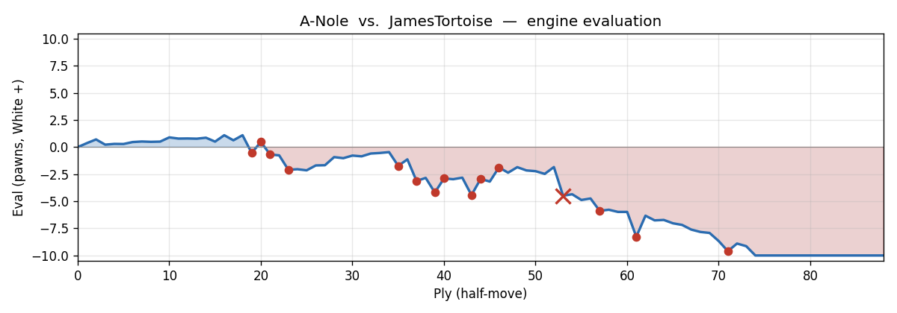

---

## Opening Narrative

A 15-minute game with increment between two club-level players — A-Nole on White, JamesTortoise (you) on Black — begins with **1. e4 Nf6**, steering into the Alekhine's Defence, Scandinavian Variation. After **2. Nc3 d5**, the position takes on a French-Advance flavour once the e-pawn pushes to e5, but the Alekhine label sticks: you came out swinging on move one, daring White to advance his centre and then attacking it.

The broad character of this game is one of White gradually losing his footing in an opening he may not have been fully prepared for, and you steadily tightening the grip — not cleanly, but persistently. There are mutual inaccuracies through the opening, a couple of genuine blunders from both sides in the middlegame, and then a decisive sequence starting around move 27 where White collapses and you convert with some real imagination, capped by an unexpected queen sacrifice that the engine endorses as brilliant. The game ended by abandonment with a forced mate in five hanging over the board.

## Move-by-Move Walkthrough

**1. e4** — the most natural start, occupying the centre. **1...Nf6** — and you immediately challenge it.

### 1...Nf6

This is Alekhine's Defence. Technically the engine slightly prefers **1...e6** (a pure French setup), but **1...Nf6** is a fully legitimate opening choice — it invites White's e-pawn to overextend and has been used at the highest levels. Don't overthink the engine's small preference here; the Alekhine is a principled fighting reply to **1. e4**.

### 2. Nc3

White declines the most principled Alekhine response. **2. e5** — pushing the knight back and claiming space — is the main line, and the engine confirms it keeps White's edge intact. Instead, **2. Nc3** is a quieter, slightly offbeat choice; perfectly playable, but it lets you equalize more comfortably. The position after **2...d5** fits the "Scandinavian Variation of Alekhine's Defence" label exactly.

**2...d5** — fine, nearly as good as the engine's first choice **2...e5**. Crucially, this move also opens d7 as a retreat for your knight, which matters once White pushes **3. e5**.

**3. e5 Nfd7** — the knight hops back, vacating f6. The engine would have preferred the more combative **3...d4**, but **3...Nfd7** is solid and thematic. **4. f4 e6 5. d4** — White builds an imposing pawn centre: e5, f4, d4. This is the French-Advance structure by another route.

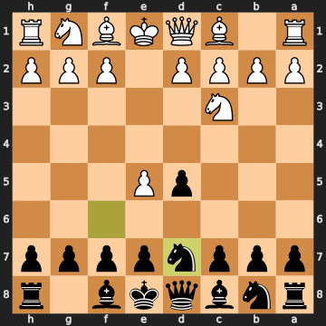


### 5...Qh4+

Now here's an interesting moment. You bring the queen out early with a check — **5...Qh4+** — and the engine flags this as an inaccuracy. The better plan was **5...c5**, immediately hitting White's centre where it's weakest: the d4-pawn. **5...c5** after **6. Nf3** keeps the eval near equal and follows the thematic Alekhine/French plan of striking the base of the pawn chain.

What did **5...Qh4+** accomplish? It forced **6. g3**, which gains a tempo by chasing the queen back to d8. You've given White a free developing tempo, weakened his kingside slightly (g3 is a real concession — it softens those light squares), but ultimately the queen has moved twice and gone nowhere productive. The check is the kind of move that feels active but doesn't really threaten anything lasting. The position becomes slightly more comfortable for White as a result.

**6. g3** — attacks your queen. **6...Qd8** — the only reasonable retreat, and the engine agrees it's best. **7. Be3 Bb4** — you pin the c3-knight, which is actively useful. **7...c5** was the engine's preference, but **7...Bb4** does something concrete and keeps options open.

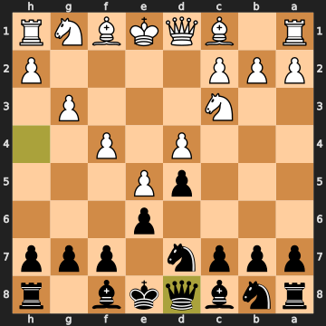


### 8. Bd2

White sidesteps the pin with **8. Bd2**, but this is an inaccuracy — the bishop on d2 is going to be passive for a long time, blocking the queen from developing naturally and doing little besides getting in its own pieces' way. The engine preferred **8. Ne2** or **8. Nf3**, both of which retain a meaningful edge. After **8. Bd2**, the eval dips from +0.87 to +0.51 — White has let real advantage slip through his fingers.

### 8...c5

You respond with **8...c5**, finally hitting the centre. The engine actually slightly prefers **8...Be7** here — a quieter retreat that keeps the bishop active and prepares to develop normally before committing the c-pawn. The issue with the immediate **8...c5** is that it gives White the option of reacting dynamically. The eval nudges against you slightly, from +0.51 to +1.10. That said, **8...c5** is the right *idea* — you're just playing it one move too early, before completing development.

### 9. Nf3

White develops, but the engine wanted **9. Nb5** here. Look at the position: your bishop on b4 is sitting on a square where it can be kicked by a pawn, with only a5 as a safe retreat. **9. Nb5** would have immediately threatened the bishop, forced it to move, and then the knight could hop to d6, becoming a monster piece threatening both c8 and f7. Instead, **9. Nf3** is just routine development — it lets you avoid that discomfort entirely.

### 9...Nc6

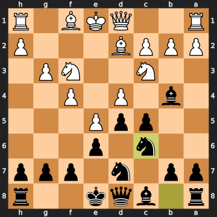


You play **9...Nc6**, developing naturally. The engine prefers **9...cxd4** — capturing in the centre while White's pieces are slightly awkward. After **9...cxd4 10. Nxd4 Nc6**, you'd have dissolved the tension favourably. But **9...Nc6** is not bad; it just passes the moment to unbalance things on your terms.

### 10. Bb5

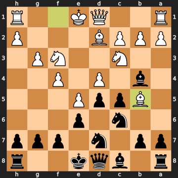


And now A-Nole walks into a significant mistake. **10. Bb5** pins your c6-knight, which looks logical — but it misses the point of the position entirely. The engine wanted **10. Nb5**, which we discussed above: harassing the b4-bishop before it can create trouble. **10. Bb5** allows you to simply castle and get your king safe while White's bishops are bizarrely doubled on the b-file (Bb5 alongside Bd2, with the d2-bishop going nowhere). The eval swings from +1.10 to -0.54 — White has just handed you the advantage.

### 10...O-O

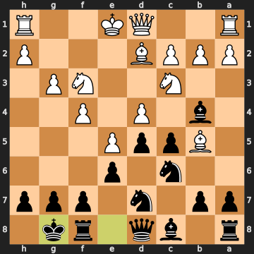


But you don't fully capitalise. **10...O-O** is safe — and it is still fine — but the engine wants **10...cxd4**, immediately winning a pawn. After **10...cxd4 11. Ne2 Bc5**, Black is up a pawn and White's pieces are tangled. You settled for castling, which brings you back to rough equality (+0.49 from White's perspective), throwing away the window White had opened.

The lesson here is worth absorbing: when your opponent gives you a free pawn, take it. The position looked complicated — White has two bishops aimed at your queenside — but **cxd4** sidesteps all that by simply winning material. You had the bishop pair as insurance, and even if White kicked your c5-bishop, you'd be up a clean pawn.

### 11. Bxc6

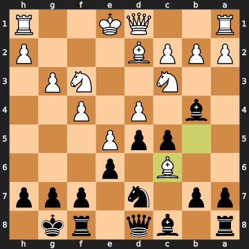


A significant mistake from White. He captures on c6 with **11. Bxc6**, trading his well-placed bishop for your knight. The engine wanted **11. a3** — kicking the b4-bishop before it can cause damage, keeping a clear advantage. By capturing on c6, White gets a structural concession for you (doubled c-pawns, but also the open b-file), and simultaneously loses the strong b5-bishop that was doing real work. The eval slides from +0.49 all the way to -0.68. White has now given you the advantage for the second time.

### 11...bxc6

The only recapture that makes sense — and it's exactly right. **11...bxc6** takes back, gives you doubled c-pawns (c5 and c6), but also opens the b-file for your rook and removes the last minor piece defending d4. The bishop alternative **11...Bxc3** or **11...cxd4** are both enormously stronger according to the engine (the line **11...cxd4 12. Bxd7** wins massive material), but the point is that both alternatives require you to calculate a concrete sequence. **11...bxc6** is the safe, pragmatic recapture and keeps you comfortably better.

### 12. Qe2

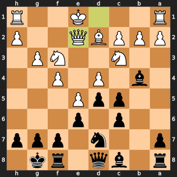


Now White makes the game-deciding mistake in the opening phase. **12. Qe2** is a significant error — the eval plummets from -0.76 to -2.09. White wants to tuck the queen away from the b4-bishop's pressure and maybe support e5, but this moves the wrong piece to the wrong square. The engine wanted **12. Na4**, attacking the c5-pawn and the b4-bishop simultaneously, keeping things alive.

Why is **12. Qe2** so bad? It clears d1, but d1 wasn't what needed clearing. The bigger problem is that Qe2 does nothing active, while you immediately have **12...cxd4**, winning the d4-pawn. The queen on e2 turns out to just be a target — you'll chase it around the board over the next several moves.

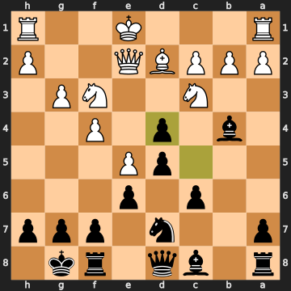


**12...cxd4** — best, snapping up the free pawn. After **13. Nxd4**, the position is open with you up a pawn and White's pieces still uncoordinated.

### 13...Qc7

**13...Qc7** — you centralise the queen and put it on a useful square. The engine slightly preferred **13...Qb6**, which attacks the d4-knight and puts immediate pressure on b2, maintaining the full -2.14 evaluation. **13...Qc7** backs off that pressure a touch, allowing the eval to rise to -1.69. Still comfortably in your favour, but you had a more forcing option available.

**14. O-O-O** — White castles queenside, which is correct: he needs his king safe and his rook on d1 active.

### 14...Nc5

**14...Nc5** jumps the knight to an active outpost. The engine preferred **14...a5** or **14...Rb8**, both aimed at exploiting the half-open b-file and rolling the queenside pawns before White can stabilise. **14...Nc5** is thematic — the knight eyes both d3 and the a6 square — but it allows White to consolidate slightly. Eval rises from -1.67 to -0.92. You're giving back some of the advantage without needing to.

**15. h4** — White pushes the h-pawn, trying to generate something on the kingside, while also poking at your b4-bishop. **15...Ba6** — you activate the bishop, pointing it at the queen on e2, and forcing White to react.

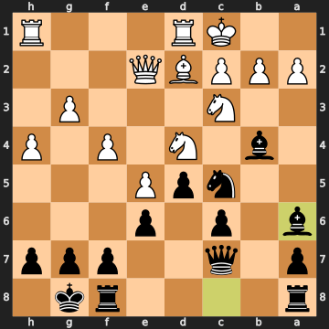


**16. Qg4 16...Bxc3** — you trade the bishop for the c3-knight. The engine preferred **16...Nd7** to keep the bishop and maintain the attacking piece. **16...Bxc3** is fine though, releasing some tension and leaving White with a potentially weak c-file.

### 17. Bxc3

**17. Bxc3** is the only recapture that preserves White's position — **17. bxc3** would have led to **17...Qa5** with a devastating queenside attack and the b-file ripping open. So White has no real choice here.

**17...Ne4** — excellent. The knight leaps to e4, attacking the c3-bishop and claiming a beautiful central square. This is exactly how you should be using the knight — it's now the dominant piece in the centre.

### 18. Qf3

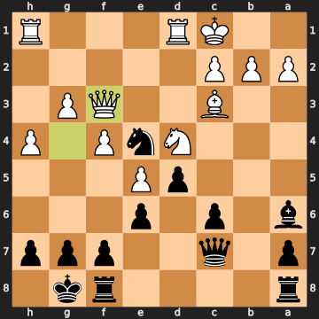


A mistake. **18. Qf3** attacks your e4-knight, but the engine wanted **18. f5**, aggressively pushing the kingside pawns forward as the only remaining source of counterplay. White's entire plan on the kingside was the f-pawn advance — the engine line **18. f5 Kh8 19. h5 c5 20. h6** shows White generating real threats that at least demand attention. Instead, **18. Qf3** just shuffles the queen and allows you to dictate the pace.

### 18...Rab8

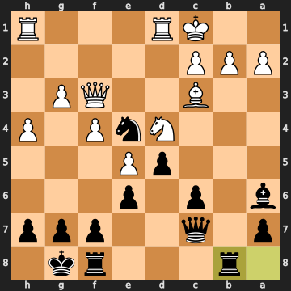


You choose **18...Rab8**, activating the rook on the half-open b-file. Reasonable, and in the spirit of the position. But the engine preferred **18...c5**, immediately pushing the c-pawn and attacking White's d4-knight. **18...c5** was the more forcing option — it maintains the -1.73 evaluation, while **18...Rab8** lets it rise to -1.13. You're still clearly better, but a sharper path was available.

### 19. b4

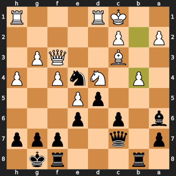


And now White drops the ball in a major way. **19. b4** is a mistake — the eval crashes from -1.13 to -3.12. White pushes the b-pawn, presumably trying to kick your c5-knight (though there's no knight on c5 at this point — that knight moved to e4 on move 17). The b4-pawn isn't attacking anything meaningful here; it's simply a queenside lunge that leaves White's structure more vulnerable. The engine wanted **19. h5** or **19. Nb3**, both maintaining the defensive structure while keeping some tension. **19. b4** is exactly the kind of aimless attacking move that loses games at club level: it looks like activity, but it's just a pawn weakening.

**19...c5** — you immediately hit the d4-knight, which is exactly right.

### 20. Nb3

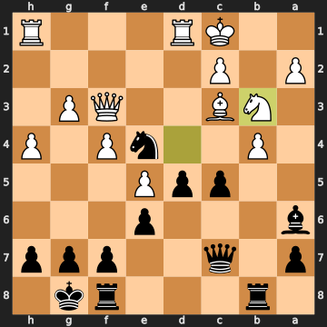


Another mistake from White. **20. Nb3** retreats the knight, but **20. bxc5** was much better — by capturing, White at least removes your passed pawn threat and stays in the game at around -2.84. After **20. Nb3**, the eval falls to -4.19. White's knight is now on b3, doing little, while your queenside play is about to become overwhelming.

### 20...cxb4

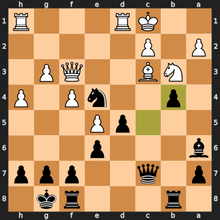


You capture with **20...cxb4**, which is fine but not the best. The engine's top choice was a beautiful tactical shot: **20...Be2!**, attacking the queen on f3 and the d1-rook simultaneously. White is forced to play **21. Qxe2 Nxc3 22. Qe3** (or similar), and you then win back material while keeping all the positional gains. **20...cxb4** keeps you solidly winning (the eval holds at -2.89 after the bishop manoeuvre White finds), but you missed a more clinical knockout.

That said, you were already massively better — don't let the engine's preference obscure that. **20...cxb4** is winning chess.

**21. Bd4** — White repositions the bishop, trying to stabilise. **21...Bc4** — you activate your bishop, hitting the b3-knight.

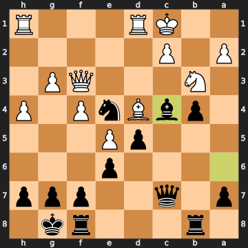


### 22. Nd2

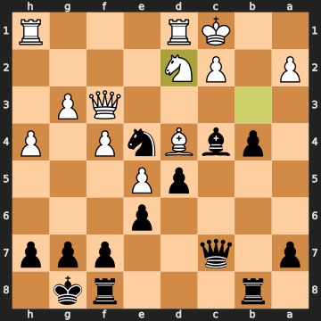


White plays **22. Nd2**, attacking both your c4-bishop and e4-knight simultaneously. On the surface this looks like a clever dual attack, and it is — but look more carefully. Both pieces are defended by the d5-pawn. Your d5-pawn is overworked: it's defending both the bishop on c4 and the knight on e4 at the same time, and it cannot save both if one falls. This should have been a genuine threat. The engine, however, assesses **22. f5** as significantly better — **22. f5 Bxb3 23. axb3** and White is trying to keep things alive on the kingside. **22. Nd2** is still a mistake (eval -4.43), arguably because of what you find in reply.

### 22...Nxd2

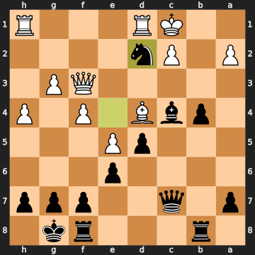


You capture with **22...Nxd2**, taking the knight. This is a mistake in the sense that **22...Rfc8** was much stronger — the engine line **22...Rfc8 23. Nb3 Bxb3 24. Qxb3 Nxg3!** wins a pawn cleanly while maintaining all your queenside pressure. The eval was -4.43 before your move; after **22...Nxd2**, it bounces back to -2.93. You gave White some breathing room by trading the active knight for a less active one.

The more concrete missed idea: after **22...Rfc8**, your bishop on c4 is no longer hanging (the rook defends it), and the knight on e4 is still defended by the d5-pawn. White's "fork" of both pieces falls apart, and you're free to press on the c-file.

**23. Rxd2** — White recaptures, forced. **23...a5** — you push the a-pawn.

### 23...a5

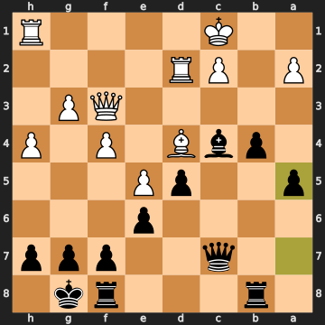


The engine wanted **23...Rfc8** here, swinging the rook to the c-file where it could pile on the pressure with **24...Qa5 25. Bb2 b3**. The a-pawn push **23...a5** eases the pressure significantly — eval rises from -3.18 to -1.87. You're still better, but the queenside counterplay just got harder to execute. Again, the theme: get your rooks to the open files.

### 24. f5

White pushes the f-pawn, trying to unblock the kingside. The engine preferred **24. Kb2**, keeping the king safer, but **24. f5** is only a minor inaccuracy. He's looking for counterplay, and the f-pawn advance at least asks you a question.

### 24...exf5

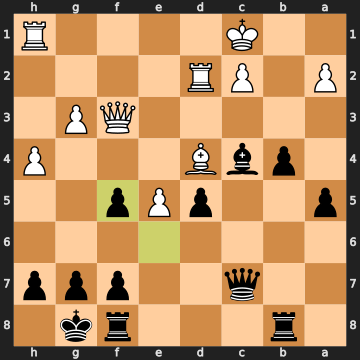


You take the pawn with **24...exf5**, which creates doubled f-pawns for you (f5 and f7). The engine preferred **24...b3** — pushing the passed b-pawn aggressively before dealing with the f-pawn. **24...b3 25. axb3 Bxb3** would have kept the initiative firmly in your hands and maintained the stronger evaluation. **24...exf5** is an inaccuracy; capturing hands White the half-open e-file and eases his position slightly.

**25. Qxf5** — White recaptures on f5. **25...Bxa2** — you snag the a-pawn. **26. e6** — White pushes the passed e-pawn aggressively into your position.

### 26...fxe6

**26...fxe6** captures the e-pawn, and the engine flags this as an inaccuracy (eval goes from -2.47 to -1.84). The better move was **26...b3** — pushing the passed pawn down White's throat before dealing with e6. After **26...b3 27. axb3 Bxb3**, you'd have a dangerous passed pawn tangled up in White's queenside while still handling the e6-pawn later. By capturing **26...fxe6** immediately, you give White the open f-file and allow him to keep his queen active via Qxe6+. You're still winning, but the position has gotten slightly looser than it needed to be.

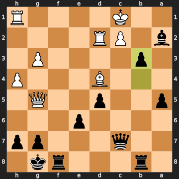


### 27. Qg5

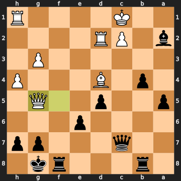


And this is where White gifts the game. **27. Qg5** is a blunder — the eval crashes from -1.84 to -4.48. White absolutely had to play **27. Qxe6+** first. After **27. Qxe6+ Qf7 28. Re2**, White still has a queen deep in your position, an active rook, and real defensive chances. By retreating the queen to g5 instead, White does... nothing in particular while you get to push **27...b3**, crashing the queenside pawns forward.

**27...b3** — still decisively winning. You push the b-pawn. The engine actually preferred **27...Rf5** to trap the White queen on g5, but **27...b3** is the right instinct — get that pawn rolling.

### 28. Bxg7

White captures on g7 with **28. Bxg7**, attacking your f8-rook. This is an inaccuracy — the engine wanted **28. c3** to create counterplay — but more importantly, it hands you a very interesting decision.

### 28...Qxg7

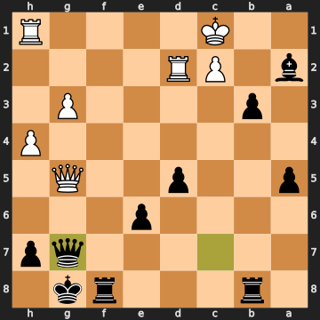


Here it is. The move flagged brilliant. **28...Qxg7** — you recapture the bishop with the queen, which means you've now just given White the opportunity to take your queen with **29. Qxg7+**. The engine endorses this as a sound sacrifice. What's the idea?

You've sacrificed the queen in the sense that after **29. Qxg7+ Kxg7**, your queen is gone. But look at the compensation: you have **b3-b2** coming, supported by the bishop on a2 (which already captures the rook on b1 if White isn't careful), the d5-e6 pawn mass rolling forward, and two rooks about to dominate open files. The eval holds at -4.74 even after the queens come off — because your material, though down on piece count for the queen trade, is winning on activity and pawns. This is a real piece of vision: you saw that giving up the queen simplifies into a completely dominant position.

To be precise about what's happening: after **28...Qxg7**, if White plays **29. Qxg7+ Kxg7**, you have the rook on b8 along the b-file, the bishop on a2 eyeing White's queenside, the b3-b2 advance imminent, and White's king on c1 with almost no defenders. The engine line goes **29. Qxg7+ Kxg7 30. Kb2 bxc2+ 31. Kxc2** and Black's position is strategically won.

### 29. cxb3

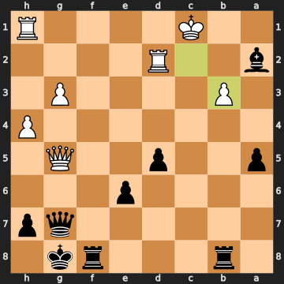


White doesn't take the queen! **29. cxb3** captures the b-pawn instead, which is a mistake. The engine wanted **29. Qxg7+ Kxg7 30. Kb2** — the queens-off endgame is White's best defensive try, and even then Black wins. By playing **29. cxb3**, White allows the g-file situation to continue, where your queen on g7 and king on g8 share the g-file with White's queen on g5 — and White never finds the pin/skewer to win your queen. The eval drops to -5.88.

**29...Bxb3** — you capture the b3-pawn. **30. Rb2** — White attacks the bishop.

### 30...a4

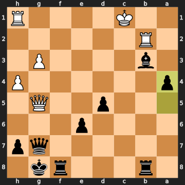


**30...a4** — engine says this is the best move and also a sound sacrifice, with the brilliant label attached. The pawn march continues: **a4** threatens to become a passed pawn after ...a3, ...a2, ...a1=Q. Even though you're nominally down material (minus five pawns' worth on the count), the connected passed pawns on the queenside are going to cost White everything. The engine line goes **31. Qxg7+ Kxg7 32. h5 a3 33. h6+** — even if White takes the queen, the pawns still queen.

### 31. Kb1

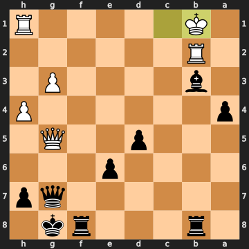


White plays **31. Kb1**, tucking the king away — but the engine still wanted **31. Qxg7+** to at least exchange queens and eliminate your most dangerous piece. **31. Kb1** is a mistake that allows the eval to plummet to -8.27. The position is now essentially over.

### 31...Qxg5

**31...Qxg5** — you win the White queen. The engine preferred the sharper **31...Bc2+** (forking the king and winning additional material after **32. Kc1 Bg6 33. Rxb8 Qc3+**), which was even more crushing. But **31...Qxg5** is flagged as the "only good move" that keeps you winning — and frankly, taking the queen is a completely natural decision. You cash in the piece advantage with interest.

### 32. hxg5

**32. hxg5** — forced recapture. This is White's only option; the alternatives are both forced mates within nine moves. The recapture creates doubled g-pawns (g3 and g5), but that hardly matters now.

### 32...Bc4

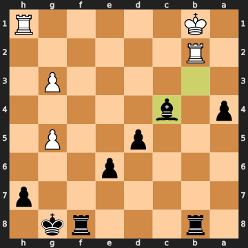


Beautiful. **32...Bc4** — the engine agrees this is best. Your bishop swings to c4, threatening to take the b2-rook (after the rook moves) and cover a whole raft of squares. Even though you're technically down material on paper (five pawns' worth), the engine has the position as nearly nine pawns in your favour because White has nothing left. The bishop on c4 is flagged brilliant: it's not obvious why this is the best move rather than, say, directly pushing the passed pawns, but the geometry is that it threatens the b2-rook while keeping the bishop active, and the engine confirms the winning plan runs **32...Bc4 33. Rxb8 Rxb8+ 34. Ka1 Rf8** — the second rook swings in and the queenside pawns march.

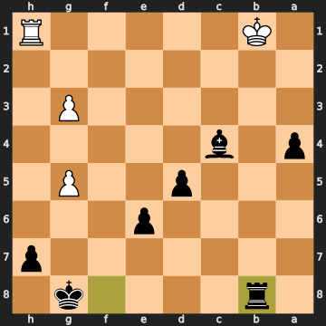


### 33. Rxb8

**33. Rxb8** — White captures on b8, attacking the f8-rook.

**33...Rxb8+** — you recapture with check.

### 34. Kc2

White plays **34. Kc2** — the engine wanted **34. Ka1**, which is marginally better (barely). Both moves lead to the same long-term result. The position is now a technical endgame: White has a rook and two pawns versus your bishop, rook, and four pawns. You're massively up in material and position.

**34...a3 35. Ra1 35...a2** — the passed pawn marches to the second rank, where it will queen.

### 36. Kc3

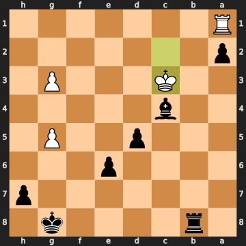


White steps forward with **36. Kc3**, which the engine calls a mistake (the best moves are all losing too, just slightly less quickly). **36. Kc3** attacks your c4-bishop.

**36...Kg7 37. Kd4** — White king steps forward.

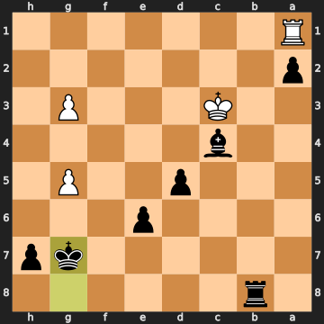


### 37...Rb1

**37...Rb1** — you attack the a1-rook. Good move; the engine's top choice of **37...Rb2** is only marginally stronger. After **37...Rb1 38. Rxb1 axb1=Q+**, the pawn queens with check, and White has absolutely nothing.

**38. Rxb1** — White captures. **38...axb1=Q** — pawn promotes to queen. The engine points out that **38...axb1=R** (underpromotion to a rook) is technically cleaner and avoids some stalemate tricks in other positions, but **38...axb1=Q** is still completely winning — mate in 9 from this position.

**39. Ke5 39...Qf5+ 40. Kd6 40...Kf7** — the king marches up to support the queen's mating net. **41. g4 41...Qxg4 42. g6+** — White's last practical try. **42...hxg6 43. Ke5 43...Qf5+ 44. Kd6 44...d4** — and here the game was abandoned. The position has a forced mate in five: White's king is caught in a mating net with your queen, bishop, g-pawn, and advancing d-pawn all surrounding it. There is no reasonable continuation, and White walked away from the board.

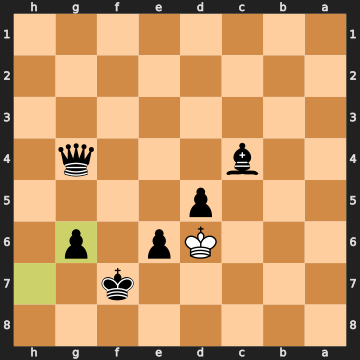


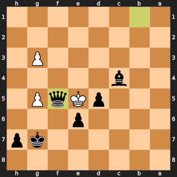


## Closing Reflection

This was a game of two halves. In the opening and early middlegame, the mistakes were fairly mutual — you got your queen out early with **5...Qh4+** and lost a tempo, missed the window to cash in a pawn after **10. Bb5**, and chose the safer recapture **11...bxc6** over the engine's more explosive alternatives. White, meanwhile, was systematically mishandling the position: **8. Bd2** was passive, **10. Bb5** was the wrong bishop move (Nb5 was the idea), and **12. Qe2** was a serious positional error that let you win the d4-pawn and take a real material and positional advantage.

The middlegame was where the game's character became clear. White kept choosing aimless moves — **19. b4** with no target, **20. Nb3** retreating from a pawn that could simply be captured — while you steadily accumulated advantages on the queenside. Your best moment was **28...Qxg7**: sacrificing the queen for the bishop while trusting that your passed pawns, active rooks, and bishop were worth more than the queen itself. The engine agrees. That's the kind of move that requires genuine chess vision — not just "my queen is en prise," but "the resulting position with three pawns and two rooks is winning because the passed pawns are unstoppable and White's king is stranded." Finding that move, especially in a game with mixed accuracy throughout, is the real highlight here.

For improvement: the recurring theme in your play is hesitating at the moment when the position calls for aggression. You missed **10...cxd4** (free pawn), **11...cxd4** (winning combination), **13...Qb6** (more pressure), **20...Be2** (double attack), and **23...Rfc8** (open file domination). These aren't exotic tactics — they're the kind of direct, concrete moves that reward asking the question "can I win material right now?" before looking for positional improvements. The position was often giving you gifts; the next step is learning to take them.
