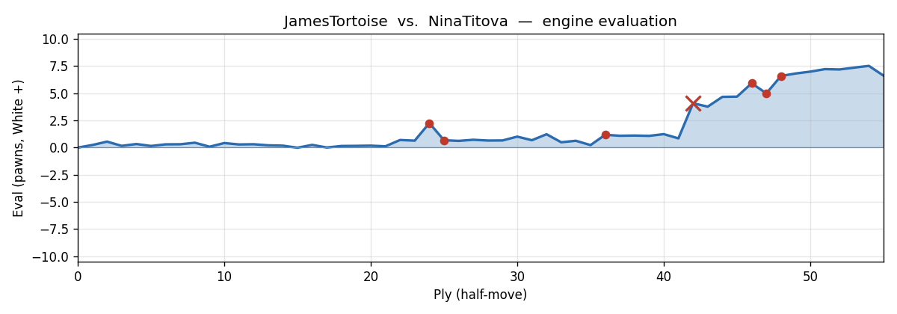
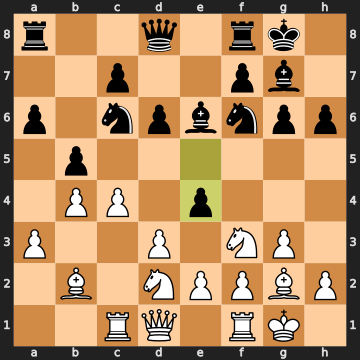
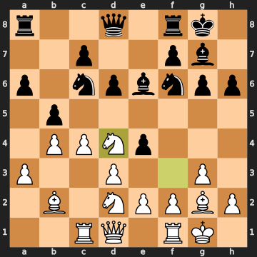
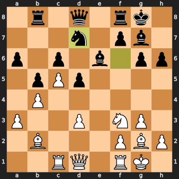
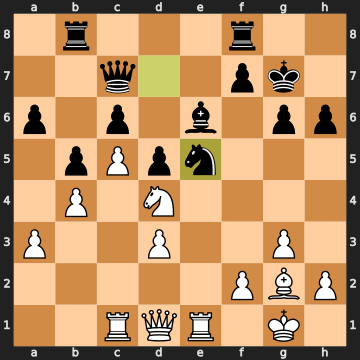
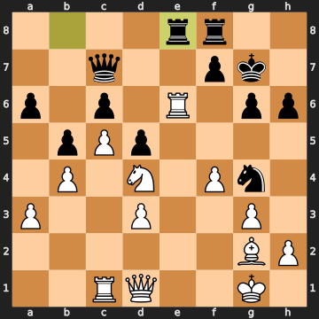
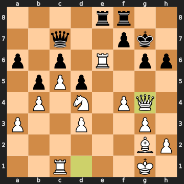
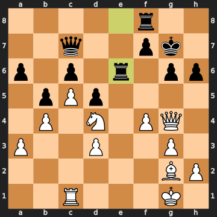

# JamesTortoise vs. NinaTitova — Live Chess (2026.05.19)

- **White:** JamesTortoise
- **Black:** NinaTitova
- **Result:** 1-0
- **ECO:** A04
- **TimeControl:** 1800 (30 min rapid)
- **White ELO:** 882
- **Black ELO:** 893

## Moves (for reference)

```
1. Nf3 d6 2. d3 e5 3. g3 h6 4. Bg2 Nf6 5. Nbd2 a6 6. b3 g6 7. Bb2 Bg7
8. Rc1 Nc6 9. a3 Be6 10. O-O O-O 11. b4 b5 12. c4 e4 13. Nd4 Nxd4 14.
Bxd4 exd3 15. exd3 d5 16. Bb2 Rb8 17. c5 c6 18. Nf3 Nd7 19. Bxg7 Kxg7
20. Nd4 Qc7 21. Re1 Ne5 22. f4 Ng4 23. Rxe6 Rbe8 24. Qxg4 Rxe6 25.
Qxe6 fxe6 26. Nxe6+ Kf7 27. Nxc7 Rc8 28. Nxa6 1-0
```


## Evaluation across the game



---

## Opening narrative

Welcome to the replay — we're looking at a 30-minute rapid game between JamesTortoise (White, 882) and NinaTitova (Black, 893). Matched nearly perfectly on rating, this is the kind of game where neither player is expected to calculate five moves deep, but patterns, instincts, and the occasional flash of tactical vision absolutely matter.

You opened 1. Nf3, signalling the King's Indian Attack — one of those systems that lets White build a coherent structure without needing to know a ton of theory. Black responded with 1...d6, which the engine mildly prefers against (1...d5 was more direct), and over the next nine moves both sides assembled their pieces in a generally sensible way. Nothing explosive early on — just two players finding their footing, the position quietly coiling.

What follows is a game of shifting advantages, a couple of mutual errors in the middlegame, and then — right at the moment you asked about — a tactical sequence that's genuinely worth celebrating. Let's walk through it.

---

## Move-by-move walkthrough

### 1...d6

A minor inaccuracy from Black right out of the gate. The engine points to 1...d5 as the most testing response — it grabs central space immediately and allows lines like 2. d4 Nf6 3. c4 e6, fully contesting the center. With 1...d6, Black adopts a more passive setup, conceding White the freer development. It's not a serious problem, but it already suggests Black is willing to be reactive rather than proactive.

### 2. d3

And here, interestingly, you hand some of that gift back. The engine prefers 2. d4, striking the center while Black hasn't consolidated. After 2. d4 Nf6 3. c4 g6 4. g3 you'd be in something resembling a King's Indian reversed with a tempo. Instead, 2. d3 keeps things solid but misses the chance to punish Black's slightly passive setup. The position flattens back toward equality — from +0.55 after Black's inaccuracy to just +0.16 after yours.

2...e5 — Black sensibly plants a pawn in the center. 3. g3 — the fianchetto plan, right on schedule for the KIA. 3...h6 — a little slow; 3...g6 was more natural. 4. Bg2 — engine calls this best, and indeed the bishop belongs on g2 in this structure.

4...Nf6 5. Nbd2 — developing, but the engine would rather have seen 5. c4 here, staking a claim on the queenside before Black can react. The knight on d2 is fine but it slightly blocks White's most aggressive options.

### 5...a6

Black plays 5...a6 — another quiet move the engine doesn't love. 5...Be6 was significantly more purposeful, activating the bishop while contesting White's control. The engine had the position as nearly equal after your 5. Nbd2, but Black's 5...a6 gifts you a small edge back (+0.42). At this level and time control, though, 5...a6 is completely understandable — it prepares ...b5 and keeps options open.

6. b3 c6 — Black continues sensibly. 6...g6 — preparing the dark-squared bishop to come out. 7. Bb2 Bg7 — both sides completing their development plans, nothing alarming.

8. Rc1 — you put the rook on the c-file with an eye toward the c4-c5 advance. Slightly premature (castling first was the computer's choice), but not harmful. 8...Nc6 9. a3 Be6 10. O-O O-O — and both kings are safely tucked away. The position has a calm, strategic feel — nothing has blown up, and it's time to start maneuvering.

### 11. b4

The game shifts into the middlegame proper, and you push 11. b4 — the natural queenside expansion. The engine actually marginally prefers 11. c4 first, but this move is entirely reasonable and consistent with the KIA plan, only a 6 centipawn loss. The eval stays close to dead level.

### 11...b5

And here Black makes a positional misjudgment. Pushing 11...b5 tries to close the queenside, but the engine rates it a 58-centipawn inaccuracy — 11...Qd7 was the way to stay solid. The issue with 11...b5 is that it fixes the pawn structure in a way that may help White more than Black, and it leaves the a6 pawn somewhat weak longer term. The evaluation jumps from +0.12 to +0.70 in White's favour.

12. c4 — exactly right, immediately challenging that structure.

### 12...e4




Hold on — now this is a real decision point, and it's a mistake. Black plays 12...e4, trying to advance in the center and shut down your knight on f3. But the engine awards this a 162-centipawn loss — a significant mistake. The right move was 12...bxc4, trading pawns and leading to a more complex but defensible position after 13. Nxc4 Rb8 14. Qa4 Ne7. Instead, 12...e4 lunges forward without proper preparation. The eval leaps from +0.64 to +2.26.

### 13. Nd4




And... you miss it. This is the moment. The engine wanted 13. dxe4 — simply capturing the pawn. After 13. dxe4 Bd7, White keeps a significant material and positional advantage (+2.26). Instead, 13. Nd4 drops that advantage sharply, falling from +2.26 all the way back to +0.68. The knight retreat to d4 isn't bad — it looks active and centralizing — but it allows Black to consolidate by trading knights, erasing the advantage the e4-pawn mistake had created. In rapid chess, these missed "simple" recaptures are extremely common; the temptation to do something flashy (centralizing the knight) wins out over the clinical approach. It's a fully understandable choice at this level.

### 13...Nxd4

Black finds the only good move — 13...Nxd4, swapping off the well-placed knight. The alternatives were considerably worse: 13...Bd7 walks into 14. Nxc6, and 13...Ne7 into 14. Nxe6. So NinaTitova trades correctly.

### 14. Bxd4

You recapture with 14. Bxd4 — automatic and correct, restoring the material balance at zero.

14...exd3 — Black captures the d3-pawn, and you recapture: 15. exd3 — all forced, the position resets structurally. The e-file is now open.

### 15...d5

Black pushes 15...d5 — the engine rates this a mild inaccuracy (35 cp). The better square for that energy was 15...Rc8, activating the rook while the e-file is open. After 15...Rc8 16. Bb7 Rb8 17. Bxa6 c6, Black is generating queenside counterplay. With 15...d5 instead, White's advantage ticks up to +1.01.

### 16. Bb2

You retreat the bishop to b2, which loses some of that gain. The engine calls for 16. Qb3 — a more aggressive placement, directly targeting b5 and d5 simultaneously. After 16. Qb3 bxc4 17. dxc4 dxc4 18. Qb2, White maintains pressure. With 16. Bb2 the eval slips back to +0.68. Understandable move — the bishop is fine on b2 in the KIA setup — but the queen was more pointed here.

### 16...Rb8

Black plays 16...Rb8 — rook to the semi-open b-file, but the engine prefers 16...Ne8, pulling the knight back to regroup. Rooks typically want open files, but the b-file isn't going to open easily. This is an inaccuracy (55 cp), and White's advantage grows to +1.23.

### 17. c5

You play 17. c5, staking space on the queenside. The engine would prefer 17. cxb5 axb5 18. Nb3, winning the b5 pawn and maintaining an edge after 18...Bd7 19. Nd4. Your move is a positional advance that makes sense — you want to control the queenside — but it's a 74-centipawn inaccuracy, dropping the eval from +1.23 back to +0.49. At 882 ELO in rapid, these queenside decisions involve genuine complexity, and the impulse to advance rather than trade is natural.

17...c6 — Black holds firm. 18. Nf3 — the engine suggests 18. Nb3 instead, keeping the knight active and eyeing d4 again after 18...Qd7 19. Qd2. Your 18. Nf3 is another inaccuracy (40 cp), retreating the knight to a less threatening post. The eval drops to +0.23 — the game is nearly equal again.

### 18...Nd7




Now Black makes a real mistake — a 95-centipawn blunder of judgment. Playing 18...Nd7 looks logical (centralizing, supporting c5 pressure), but the engine points to 18...Bg4 as the correct move. With 18...Bg4 19. Rc2 a5, Black is actively pinning the knight on f3 and generating queenside counterplay. The difference is that 18...Nd7 allows you to snatch the bishop on g7 immediately, which you do.

19. Bxg7 — you take it, winning a bishop. Material count goes to +3.0 in your favour. Clean.

### 19...Kxg7

Black recaptures with 19...Kxg7 — the only reasonable response. Anything else was much worse: 19...Bg4 loses to 20. Bxf8, and 19...a5 blunders even more material. So the king steps in to take back, landing on g7 — technically the only good move, though it does expose the king slightly on the g-file.

20. Nd4 — knight to d4, centralized and menacing. 20...Qc7 — Black defends, keeping an eye on c5.

### 21. Re1

You activate the rook with 21. Re1, aiming at the open e-file. The engine mildly prefers 21. Rc2 — the idea being 21...Rbe8 22. a4 bxa4 23. Ra2, generating queenside play while keeping the rook more flexibly placed. Re1 is a natural and good-looking move, just slightly imprecise (39 cp). The eval is still firmly in your favour at +0.85.

### 21...Ne5




And here — this is the big one. Black plays 21...Ne5, and it's a catastrophic blunder. A 323-centipawn swing. The engine says 21...Rfe8 was the way to go, simply defending the e-file. With 21...Ne5, NinaTitova walks the knight into a tactical disaster that you are about to exploit. The position jumps to +4.08 in your favour.

### 22. f4

Now you have a winning position, and you play 22. f4 — chasing the knight. The engine actually prefers 22. Qe2 here: the line 22. Qe2 Bd7 23. Qxe5+ Qxe5 24. Rxe5 wins a piece cleanly and efficiently. Your 22. f4 still keeps a dominant advantage (+3.77) and the idea is correct — kick the knight — but you're giving Black a small chance to wriggle with 22...Bg4. It costs about 31 cp. Entirely forgivable: the position is overwhelming either way, and f4 looks forcing and energetic.

### 22...Ng4

Black moves 22...Ng4 — the knight retreats to g4, creating some activity. The engine wanted 22...Bg4 (the dark-squared bishop move) as relatively better, but honestly, Black is in serious trouble regardless. The eval stays at +4.67 for White.

23. Rxe6 — you take the bishop on e6, a clean capture. Material is now +3 for White. Good.

### 23...Rbe8




Black plays 23...Rbe8 — bringing the rook to the e-file, which looks natural but the engine calls a mistake (123 cp). After 23...Kh7, Black could at least try to weather the storm with 24. Rd6 h5 25. Qd2 Rbe8, staying in the fight. Instead, 23...Rbe8 walks into the sequence you've been preparing. The eval jumps to +5.92.

### 24. Qxg4




You play 24. Qxg4, capturing the knight. A substantial gain — material stands at +6.0 — but the engine identifies a stronger move: 24. Rxe8. The line 24. Rxe8 Rxe8 25. Qxg4 a5 26. Qd1 keeps even more material and simplifies more efficiently. Your 24. Qxg4 is still a strong move and nets you a knight, but it cost about 93 centipawns by allowing Black slightly better coordination afterward. At this point, though, you are crushing — the game is well in hand.

### 24...Rxe6




Now Black plays 24...Rxe6, capturing your rook on e6. This is a mistake by Black (160 cp). The correct try was 24...fxe6, keeping the f-pawn to support the center. After 24...fxe6 25. Nxe6+ Rxe6 26. Qxe6, White is up material but Black still has some structure. By instead taking the rook with 24...Rxe6, Black walks directly into the fork you've been building toward. The eval jumps to +6.59.

25. Qxe6 — you recapture the rook immediately. White is now up a queen and rook for two rooks — a big material advantage, and Black's position is in tatters.

25...fxe6 — forced recapture, clearing the f-file for Black (half-open for Black, as noted) while giving you the open e-file.

### 26. Nxe6+

And HERE we are. The moment you're proudest of, and rightly so.

26. Nxe6+ — the knight lands on e6 with check. The engine flags it explicitly: **the knight on e6 attacks the king on g7, the queen on c7, and the rook on f8 — a royal fork.** You've sacrificed the rook and queen to set up this knight, and it's delivering a three-piece fork that wins the queen and rook outright. The eval sits at +6.99, and more importantly, the game is effectively over. This is the only move that works here — 26. Re1 drops to -1.15 and 26. Bh3 to -1.83. You found it.

26...Kf7 — Black has to move the king; nothing else saves the queen.

### 27. Nxc7

You take the queen with 27. Nxc7 — the best move, and with it you're up seven pawns' worth of material. The game is essentially won.

### 27...Rc8

Black tries 27...Rc8 — the engine slightly preferred 27...Rd8, but it barely matters. You're up a queen with a dominant position heading into the endgame.

### 28. Nxa6

You grab the a6 pawn with 28. Nxa6, adding to your material total. The engine identifies a more precise winning plan: 28. Nxd5, winning the d5 pawn while activating lines with 28...cxd5 29. Bxd5+ Ke7. That line is a cleaner conversion. Your 28. Nxa6 is still very good and leaves you up roughly eight pawns' worth of material (eval +6.62), but it's the one moment in the endgame where a cleaner choice existed. At this stage, though, the result isn't in question — you've won convincingly.

---

## Closing reflection

Let's call this game for what it was: a hard-fought rapid game between two closely-matched players that was decided by a series of small errors on both sides — and then, just when the position looked complicated, one flash of genuine tactical clarity that sealed it.

The moment you asked about — the rook and queen sacrifice leading to the knight fork on e6 — is the real highlight here, and it deserves the credit. After 23. Rxe6 (capturing the bishop), you essentially set up a tactical cluster: the queen, knight, and open e-file all pointed at the same target. When Black blundered with 24...Rxe6, the knight fork became available, and you took it with 26. Nxe6+, hitting the king on g7, queen on c7, and rook on f8 simultaneously. Finding and executing a royal fork in a rapid game — particularly one that required setting it up over several moves — is a genuine tactical achievement. That's real chess pattern recognition at work.

What you'd want to clean up: the biggest missed opportunity came on move 13, when 13. dxe4 (simple recapture of the e4 pawn) would have maintained a decisive advantage that Black had gifted you with 12...e4. Instead, 13. Nd4 gave it all back. There's a broader theme in this game — several times you had the bigger advantage but the converting move was the quieter, more "obvious" one rather than the exciting piece leap. That's a completely normal pattern at this rating and time control, and recognizing it is already half the battle. But the finish? The finish was excellent.
