# JamesTortoise vs. blatok1 — Live Chess (2026.05.17)

- **White:** JamesTortoise
- **Black:** blatok1
- **Result:** 1-0
- **ECO:** A07
- **TimeControl:** 900+10 (15 min + 10 sec increment)
- **White ELO:** 872
- **Black ELO:** 818

## Moves (for reference)

```
1. Nf3 d5 2. g3 e6 3. Bg2 Nf6 4. d3 Bd6 5. Bg5 Nc6 6. Nbd2 Qe7 7. O-O
h6 8. Bxf6 Qxf6 9. Re1 Bd7 10. e4 d4 11. a3 O-O-O 12. b4 g5 13. b5 h5
14. bxc6 Bxc6 15. e5 Bxf3 16. exf6 Bxd1 17. Rexd1 Rh6 18. Ne4 g4 19.
h4 Be5 20. Rab1 c6 21. Rb3 Bxf6 22. Nxf6 Rxf6 23. Rdb1 Rd7 24. Be4 e5
25. Kg2 Kd8 26. Rxb7 c5 27. Rb8+ Ke7 28. R1b7 Rxb7 29. Rxb7+ Kf8 30.
Rxa7 Kg7 31. Rc7 Ra6 32. Rxc5 Rxa3 33. Rxe5 Ra2 1-0
```


## Evaluation across the game

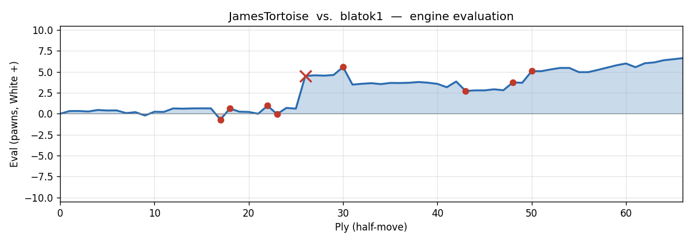

---

## Opening Narrative

Two club-level players sit down for a 15-minute game with increment — enough time to think, not enough to calculate deeply. You, playing White as JamesTortoise (872), open with **1. Nf3** and follow with **2. g3**, signalling a King's Indian Attack setup: the fianchettoed bishop on g2, a solid pawn structure, and slow build-up rather than immediate central confrontation. It's a system with a clear identity, and at your rating it's a sensible choice — you know what you want to build.

blatok1 (818), playing Black, responds with **1...d5** and **2...e6**, staking a claim in the centre in classic fashion. The middlegame that follows is scrappy and human in the best sense: both players miss things, an opportunity slips by on both sides in quick succession, and then a pawn fork lands that changes everything. The game's decisive moment is actually a quiet geometric shot — **15. e5** — that catches the queen and bishop at once, and from there you convert with reasonable care despite a couple of stumbles.

The endgame sees blatok1 fighting hard with rooks but ultimately conceding. White wins by resignation, with a final engine evaluation of +6.64.

---

## Move-by-Move Walkthrough

**1. Nf3 d5 2. g3 e6 3. Bg2** — The King's Indian Attack takes shape: knight out, fianchetto complete. Both players are in book territory. **3...Nf6** — Black develops naturally toward the centre.

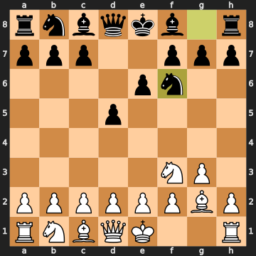


### 4. d3

Here's the first moment worth pausing on. **4. d3** is classified as an inaccuracy, and you can see why: the engine prefers **c4** immediately (eval +0.40 vs. +0.08 after d3), arguing that White should stake a claim in the centre before tidying up the queenside. The KIA plan of d3 isn't wrong in principle — it supports e4 later — but **c4** here exerts direct pressure on d5 and opens a diagonal for the g2-bishop right away. At your rating and time control, though, d3 is a completely natural and human KIA move. It's the kind of structural choice that keeps the position coherent even if it's not the computer's first pick.

**4...Bd6** — Black develops the bishop, though **Be7** is the engine's preference, keeping the diagonal cleaner. Either way, both sides are finding reasonable squares.

### 5. Bg5

And here's a more consequential inaccuracy. **5. Bg5** pins the knight on f6, and it's not without menace — but the engine firmly prefers **c4** (or castling), keeping the bishop in reserve and centralising the play. The trouble with **Bg5** this early is that it invites **...h6** to kick the bishop immediately, giving Black a free tempo. The simple **5. c4** would have kept the position slightly better for White (+0.19 vs. −0.21 after Bg5). Posting the bishop outside the pawn chain before consolidating the centre hands Black the initiative.

### 5...Nc6

Interesting — blatok1 misses the best response. **5...h6** was correct, immediately challenging the bishop: after **Bxf6 Qxf6**, Black trades off the pin, gets the bishop pair, and holds a slight edge (−0.21). Instead, **5...Nc6** develops but allows White to maintain the pin and keep the position roughly level (+0.24). At this level, not everyone naturally thinks "kick the piece that's bothering me first" — the instinct to develop is strong.

**6. Nbd2** — Sensible development, supporting the centre. **6. d4** was fractionally stronger, but Nbd2 is fine.

### 6...Qe7

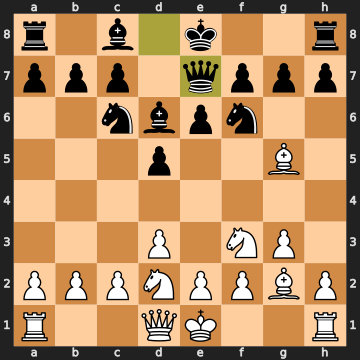


Now this is a notable error. **6...Qe7** brings the queen out prematurely, blocks the f8-bishop's development (delaying castling), and doesn't achieve much. The natural **6...Be7** (or even **6...h6** to chase the bishop) keeps everything coordinated. After **6...Qe7**, White's advantage ticks up from +0.22 to +0.64 — not a disaster, but Black is already making life harder than it needs to be.

**7. O-O** — You castle, sensibly. **7. c3** was the engine's top pick, but castling is entirely reasonable — getting the king safe is never wrong.

**7...h6** — Best move, finally. Black kicks the bishop with **7...h6**, attacking the g5-bishop.

**8. Bxf6** — Correct and best: the bishop takes the knight before it gets chased for free. The capture also attacks the queen on e7 as the bishop lands on f6.

**8...Qxf6** — The queen recaptures, and now she sits on f6 where she eyes your knight on f3. The position is balanced, with White slightly better.

### 9. Re1

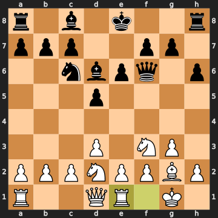


Hold on — this is the big mistake of the opening, and it's a quiet one that's easy to miss. You play **9. Re1**, placing the rook on e1, presumably preparing to support a later e4 push. But the engine's choice is **9. c3** (+0.64), and the reason is concrete: **c3** immediately challenges Black's d4 pawn if it ever advances, prepares d4 to claim the centre, and maintains the edge. After **9. Re1**, the eval swings all the way from +0.64 to −0.70 — you've handed Black a small but real advantage.

Why? Because Re1 is slow, and in the meantime Black has real options: active queen on f6, knight on c6 eyeing d4, and the bishop pair still intact. **c3** was the move, consolidating the structure and preparing central play immediately.

### 9...Bd7

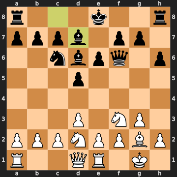


And here blatok1 hands the advantage straight back. The engine's move is **9...Qxb2** — a free pawn grab. After **9. Re1**, the b2-pawn is completely undefended, and **...Qxb2** wins it with tempo (White is already down the initiative, so there's no immediate punishment). The eval after ...Qxb2 would be −0.70 in Black's favour. Instead, **9...Bd7** just develops — a safe but timid choice that lets White recover. At 818, it's very human to leave a pawn alone that "feels" dangerous to take. In reality, after **...Qxb2 e4 O-O**, Black would be a clear pawn up with no problems.

### 10. e4

You push **10. e4** to expand in the centre. The engine still prefers **c3** first (+0.63 vs. +0.25 after e4), the idea being to challenge Black's d-pawn before expanding. After **10. e4**, Black can and does lock the centre with **10...d4**, which gives Black a space advantage on the queenside and closes things down in a way that slightly favours the side with more active pieces elsewhere. Still, **e4** is far from losing — it's thematic KIA play and you're at +0.25.

**10...d4** — Best move. The engine agrees. Now notice something: **10...d4** leaves the queen on f6 and bishop on d6 sitting on adjacent diagonals — a formation that a pawn fork from e5 would hit beautifully. This isn't punishable yet, but the geometry is there.

### 11. a3

**11. a3** is a space-gaining push on the queenside, but the engine prefers **Rc1** (maintaining +0.22 vs. +0.00 after a3), which prepares to challenge the centre with c3 immediately. The difference is that **Rc1** keeps the initiative, while **a3** is a bit of a tempo-waster — the queenside push can wait. The eval settles to dead even (0.00) after **a3**. Your most passive piece at this point, by the way, is the bishop on g2, which is being blocked by its own pawn chain — a note to keep in mind.

### 11...O-O-O

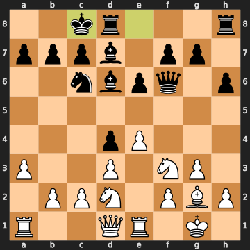


A real mistake. blatok1 castles queenside, walking the king right into danger — your b4-c4 pawn advance is now natural and strong, and more importantly, the queen on f6 and bishop on d6 are still on those forkable squares. **11...e5** was correct (eval 0.00), keeping the position level; **11...O-O** kingside was also fine. By castling queenside, the eval jumps from 0.00 to +0.96 in your favour.

### 12. b4

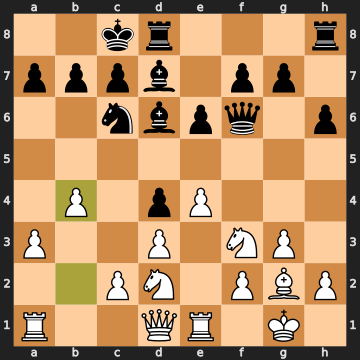


You miss it! **12. b4** is a reasonable queenside advance that attacks the c6-knight indirectly, but the engine is screaming **12. c3** (+0.96 → −0.04 after b4). Why? Because **c3** attacks the d4-pawn immediately: after **c3 dxc3 bxc3 Qxc3 Rc1**, you win the pawn back and open lines on the queenside with your rooks pointed at the newly exposed Black king on c8. But more critically — notice that the queen is still on f6 and the bishop is still on d6. **e5** is already looming as a pawn fork, but **c3** first sets it up more efficiently. **b4** is not bad per se, but you let Black off the hook momentarily (eval drops to −0.04, nearly level).

### 12...g5

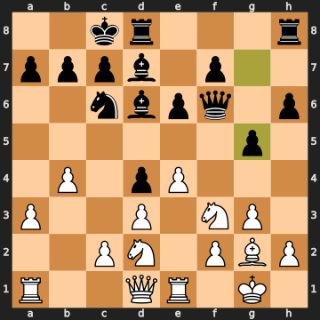


Black makes a kingside pawn push with **12...g5**, which has a purpose — the engine notes that it threatens to kick your f3-knight, which has only one safe retreat: e5. But here's the thing: **12...e5** was the right move (eval −0.04, maintaining equality), keeping the pawn fork at bay. After **12...g5**, the eval swings back to +0.70 in your favour, because you still have the **e5** fork available. **12...g5** also serves as an inadvertent reminder that the fork window is still wide open.

**13. b5** — Best move. You advance the b-pawn to b5, attacking the c6-knight directly. The bishop on d7 also has only one safe retreat now: e8.

### 13...h5

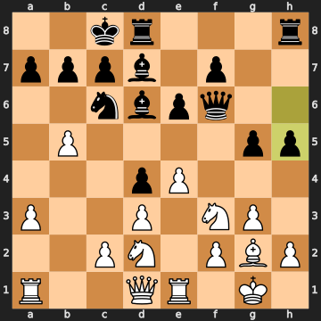


A blunder — and the move that decides the game. **13...h5** is a crude kingside push, continuing the pawn storm idea, but it completely ignores the fork threat. **Ne5** was the only good move (+0.61), stepping the knight out of danger. Every other option was significantly worse. After **13...h5**, the eval rockets to +4.51. The reason is simple and brutal: Black has just allowed **14. bxc6** to win the knight on c6, and after that, **15. e5** lands the pawn fork on the queen and bishop with nothing to stop it. **13...h5** was Black playing as if the position was just a kingside pawn race, completely blind to what was about to happen on the other side of the board.

### 14. bxc6

You see it and take it. **14. bxc6** captures the knight, winning a piece and simultaneously attacking the d7-bishop. Yes, this doubles your pawns on the c-file, but that's an entirely acceptable structural concession for a free knight. The b-file is now half-open for White, and the material count swings to +3 in your favour.

**14...Bxc6** — Forced recapture. Black is already down a piece.

### 15. e5

This is the moment — and you play it perfectly. **15. e5** advances the pawn to e5, and the engine confirms: it attacks both the queen on f6 AND the bishop on d6 simultaneously. That's a double attack (a pawn fork), and both pieces cannot both be saved. The eval is +4.63 — the game is essentially over. 

Look at the geometry that made this possible: the queen had been sitting on f6 since move 8, and the bishop had been on d6 since move 4. Through the whole opening, that pairing was a structural weakness waiting to be exploited. Every time the engine suggested **e5** in the previous few moves, it was pointing at exactly this fork. You found it when it mattered.

### 15...Bxf3

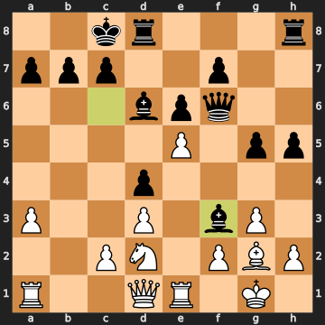


Black plays **15...Bxf3**, capturing the knight on f3. The bishop attacks both your queen on d1 and your bishop on g2 — a double attack of their own. But it's desperation: **15...Qg7** was the engine's best try (+4.63), saving the queen with the bishop on d6 still on the board. After **...Bxf3**, the eval goes to +5.58 because Black is giving up material in a position that was already losing. The double attack on d1 and g2 looks scary, but it doesn't change the arithmetic.

### 16. exf6

Now here's an interesting choice. The engine prefers **16. Nxf3** (recapturing the bishop, eval +5.58), which keeps the doubled f-pawns at bay. Instead, you play **16. exf6** — capturing the queen with the pawn! The eval drops from +5.58 to +3.48, meaning you've left some material on the table, but you're still decisively winning. The key: after **exf6**, Black takes your queen with **...Bxd1**, then you recapture **Rxd1**, and the material count settles: you've given up your queen but taken Black's queen and bishop. The position is a rook-and-bishop vs. rook endgame with an extra pawn advantage. The note: **Nxf3** would have been cleaner and kept a bigger edge, but **exf6** was a practical choice — probably you saw "pawn takes queen" and went for it. It works.

**16...Bxd1** — Black grabs the queen. **17. Rexd1** — You recapture with the e-rook. Material count: +2 for White (you're ahead roughly a rook-pawn equivalent). The queen trade has simplified considerably.

**17...Rh6 18. Ne4** — You centralise the knight, attacking the d6-bishop. **18...g4 19. h4** — Both sides push kingside pawns; you play h4, fixing the pawn structure.

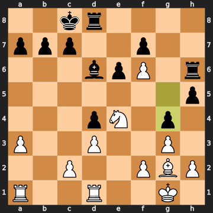


**19...Be5 20. Rab1** — You activate the a1-rook, bringing it to the open b-file. The engine notes the black bishop on e5 can be kicked by a pawn push; **20...c6** — Black creates a retreat square for the bishop, opening c7 as an escape. Smart defensive move.

**21. Rb3** — You post the rook to b3, eyeing the b7-pawn. The engine would prefer **Rf1**, but you're still winning (+3.17).

### 21...Bxf6

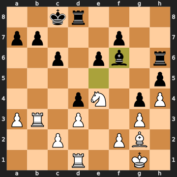


blatok1 captures the f6-pawn with the bishop: **21...Bxf6**. The engine prefers **21...Kc7** (staying at +3.17), but **Bxf6** drifts to +3.85. At this stage, with rooks and a bishop each, the pawn grab looks tempting — but **Kc7** would have centralised the king and maintained slightly better defensive coordination. Still, the position is lost regardless.

### 22. Nxf6

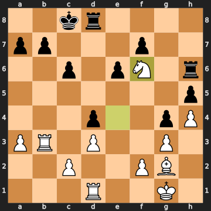


And here you make a mistake by instinct. **22. Nxf6** recaptures with the knight (+3.85 → +2.72), and the engine points out that **Rdb1** was stronger (+3.85), doubling rooks on the b-file and crashing through before Black can consolidate. After **Rdb1 b6 Nxf6 Rxf6 Bxc6**, you'd be winning material while keeping the rooks active. By taking immediately with the knight, you allow the rook to recapture and unclutter Black's position slightly. Still decisive, but you gave away some extra edge — the "strike while rooks are doubled" idea was the cleaner path.

### 22...Rxf6

Recapture — forced and best.

### 23. Rdb1

**23. Rdb1** doubles the rooks on the b-file. The engine marginally prefers **Be4** first, but the difference is trivial and all three top options are essentially equal (+2.79). Getting both rooks on the b-file is a natural and strong plan.

**23...Rd7 24. Be4** — You activate the bishop to e4, pointing at the queenside. **24...e5** — Black advances the e-pawn, but this is a mistake (eval +2.81 → +3.74). The engine prefers **...Rh6**, keeping the rooks more active. **24...e5** hands you a target.

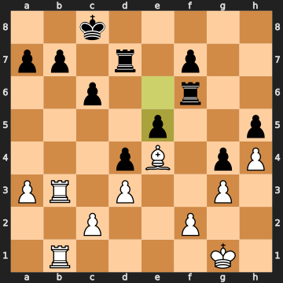


### 25. Kg2 25...Kd8

You play **25. Kg2**, safely stepping the king off the back rank. **25. a4** was marginally better but both are fine. Then blatok1 plays **25...Kd8** — a real mistake, moving the king away from the queenside where the rooks are most threatening (+3.70 → +5.09). **25...b6** was the engine's suggestion, preparing some counterplay. **25...Kd8** walks the king in the wrong direction.

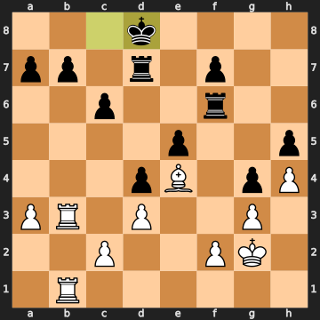


### 26. Rxb7

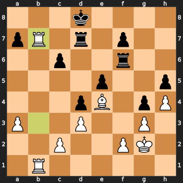


Now this is clean and decisive. You play **26. Rxb7**, a rook sacrifice that the engine confirms as sound and brilliant. You "invest" the rook but Black cannot profit: after **Rxb7 Rxb7 Rxb7 a5 Ra7**, you sweep up both b7 and a7 pawns and the resulting position with bishop and pawns versus a rook is completely winning. The engine eval holds at +5.08 — the material swing is temporary; the pawn harvest is assured.

What you saw: Black's b7-pawn is hanging, and the rook on d7 is attacked after **Rxb7**. When Black plays **26...c5** (trying to sidestep with a pawn thrust) rather than accepting the exchange, you follow up with **27. Rb8+** — a check that forces the king away.

**27. Rb8+ Ke7** — Black steps to e7, forced.

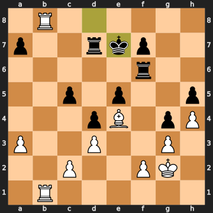


**28. R1b7** — You bring the second rook to b7, attacking the d7-rook. The engine liked **Rh8** here slightly more (+4.97 vs. +5.47), targeting the h-file, but **R1b7** keeps the pressure on and is perfectly winning.

**28...Rxb7** — Black captures the rook on b7.

### 29. Rxb7+

Recapture with check. The only move and the best move, as confirmed by the engine. After **29...Kf8 30. Rxa7**, you've hoovered up the a7-pawn and your rook is rampaging on the 7th rank.

**29...Kf8 30. Rxa7 Kg7 31. Rc7** — You swing the rook to c7, cutting across. **31...Ra6** — Black plays **...Ra6**, the engine prefers **...c4** but Black is already lost. After **31...Ra6**, the eval is +6.03.

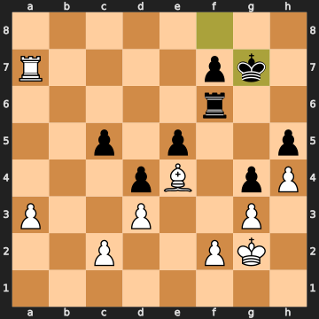


**32. Rxc5** — You take the c5-pawn, up to +4 material.

**32...Rxa3** — Black grabs the a3-pawn. Symmetrical pawn-grabbing.

**33. Rxe5** — You take the e5-pawn. Now you're up four pawns of material (+4.00), and the position is completely won.

**33...Ra2** — Black makes one last move, and blatok1 resigns. At +6.64, there was nothing left to fight for.

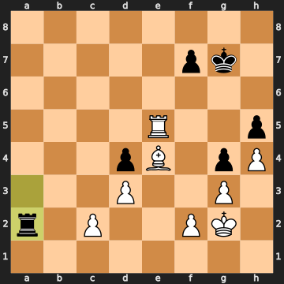


---

## Closing Reflection

This was a game decided by one move: **15. e5**. Everything before it was buildup — some good, some wasteful — and everything after it was technique. That pawn fork, hitting the queen on f6 and the bishop on d6 simultaneously, was the payoff for a geometric vulnerability that had existed since the early opening. The queen settled on f6 at move 8 and never moved. The bishop parked on d6 at move 4 and stayed. The e5 square was always available, and you played it at the perfect moment — immediately after winning the knight with **bxc6**, stripping away the last piece that might have contested e5. That's a genuine piece of vision worth crediting.

On the debit side, the two moments worth taking away: **9. Re1** was the opening's missed opportunity (c3 was the engine's route to keeping a real edge), and **12. b4** let blatok1 almost escape from a position that should already have been clearly yours. The pattern to carry forward: when there's a pawn fork on e5 available, and the queen and bishop are both sitting on that diagonal, the clock is ticking. You eventually found it — but the game dangled on a thread for a few moves while both sides missed it together. blatok1's fatal error was **13...h5**, spending a tempo on a kingside push while ignoring the fork threat entirely; that's a classic example of fixation on one plan while missing an immediate, concrete threat on the other side of the board. The resignation after **33...Ra2** was the right call — a rook against four extra pawns and a bishop was never going to save it.
