# jasonbounds vs. JamesTortoise — Live Chess (2026.05.19)

- **White:** jasonbounds
- **Black:** JamesTortoise
- **Result:** 0-1
- **ECO:** B07
- **TimeControl:** 1800 (30 min rapid)
- **White ELO:** 881
- **Black ELO:** 891

## Moves (for reference)

```
1. e4 d6 2. d4 Nf6 3. Nc3 g6 4. Bc4 Bg7 5. h3 O-O 6. Nf3 Nbd7 7. Be3
b6 8. Ng5 Bb7 9. Qf3 e6 10. d5 e5 11. Bb5 Nb8 12. O-O a6 13. a4 axb5
14. axb5 Nbd7 15. Rxa8 Qxa8 16. Rb1 Re8 17. Qe2 h6 18. Nf3 Rd8 19. b4
Rf8 20. Qd1 Qb8 21. Ra1 Kh7 22. Nh4 Ng8 23. Qf3 Bf6 24. Nf5 Re8 25.
Nxh6 Nxh6 26. Bxh6 Kxh6 27. Qe3+ Kg7 28. Qg3 Rh8 29. Qg4 Nf8 30. Nd1
Rh4 31. Qf3 Rf4 32. Qg3 Bh4 33. Qe3 Nh7 34. g3 Bxg3 35. Qxg3 Nf6 36.
Nc3 Nh5 37. Qg5 f6 38. Qg2 Bc8 39. Ne2 Rh4 40. Ng3 Nxg3 41. Qxg3 Rxh3
42. Qg2 Bd7 43. f3 Rh5 44. c3 Rg5 45. Qxg5 fxg5 46. Kf2 Bxb5 47. Rg1
Kf6 48. Ke3 Qh8 49. Rg3 Qh2 50. Rg4 Qe2# 0-1
```


## Evaluation across the game

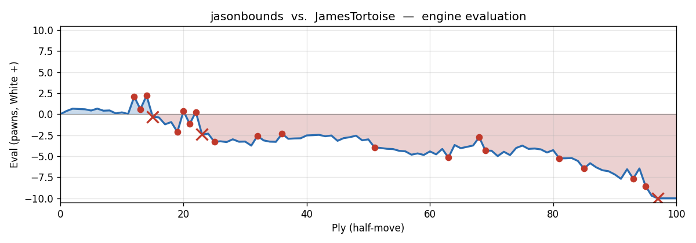

---

## Opening Narrative

Two players separated by a handful of rating points, both hovering around 890, square off in what begins as a King's Indian Defence setup — and what unfolds over the next fifty moves is a messy, human, genuinely entertaining rapid game. You (JamesTortoise, Black) are playing your stated style: fianchetto the bishop, look to lock the centre, play on the wings. White (jasonbounds) counters with a reasonably principled early setup — 1. e4, 2. d4, 3. Nc3 — before the game drifts into uncharted tactical territory for both sides.

At this rating and time control (30-minute rapid), the broad arc is predictable: neither player will find every resource, tactics will be missed in both directions, and the game will be decided less by deep calculation than by who generates the more coherent plan. What makes this particular game interesting is that you spotted something real late in the game — White's king and queen both parked on the g-file — and methodically set up a rook to exploit it. That's the kind of thing that separates a developing player from one who is still just reacting. The finish is clean and deliberate, and your opponent graciously let you deliver it.

The opening phase is surprisingly turbulent, with material opportunities left on the table by both sides in rapid succession. Then a long middlegame grind, White haemorrhaging small advantages throughout, until the position collapses into a forced mate. Let's walk through it.

---

## Move-by-Move Walkthrough

**1. e4 d6 2. d4 Nf6 3. Nc3 g6** — The King's Indian skeleton is taking shape: you're building toward the fianchetto, aiming for a closed, long-term position. White's e4-d4 centre is large and normal. 3...g6 is a standard King's Indian reply.

**4. Bc4 Bg7** — White develops the bishop to c4, which is perfectly playable though the engine slightly preferred f4 for a more aggressive Austrian-style setup. You complete the fianchetto with 4...Bg7, the thematic move.

### 5. h3

White plays h3 before developing the knight to f3. The human logic here is clear — prevent a future ...Bg4 pin on the knight — but it's premature. The engine's preferred Nf3 makes the same prevention a move later anyway (as the line Nf3 O-O O-O Bg4 h3 shows), while also developing a piece and controlling e5. By playing h3 now, White spends a tempo without developing, letting you equalise a touch. A small thing, but at this level these tempo gifts accumulate.

**5...O-O** — Correct and thematic. Castling also opens e8 as a retreat square for your f6-knight, which could otherwise get trapped by a future pawn push.

**6. Nf3 —** Natural development. White catches up.

### 6...Nbd7

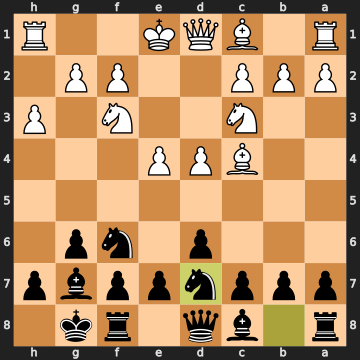


Now here's your first missed opportunity of the game — and it's a significant one. The engine's top choice is 6...Nxe4, simply winning the e4-pawn. Let's walk through why this actually works: after 6...Nxe4, White can't just take back with 7. Nxe4 (which would leave White a pawn down), so White essentially has to accept the loss. The position is nearly equal after that — both sides have normal development — but you'd have collected a free pawn.

Why did you play Nbd7 instead? Most likely the King's Indian mindset: this is a setup move, preparing ...e5, routing pieces toward the kingside for the thematic wing attack. The pawn grab on e4 felt like it might derail the plan, open lines you didn't want, or invite complications. That instinct toward chaos-aversion you mentioned is visible right here. The problem is that ...Nxe4 isn't particularly complicated: e4 is hanging, White has no immediate tactical response, and you'd simply be a pawn ahead in a normal position. The eval swings from nearly equal (+0.03) to White being up +2.08 after 6...Nbd7, largely because White gets the chance to seize space aggressively. Still, this is the kind of pawn grab that requires overriding the plan-following instinct — easier said than done at any level.

**Engine's preference:** 6...Nxe4 — it simply wins a pawn with no compensation for White, keeping the position near equal. Nbd7 surrenders that free material and allows White to consolidate with a big centre.

### 7. Be3

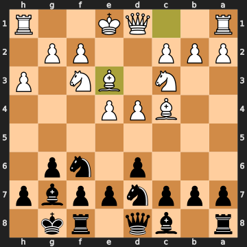


White misses the moment. The engine screams 7. e5 here — after 7. e5 dxe5, White has broken through in the centre, the d6-pawn is gone, and the position opens in exactly the kind of way that suits White's already-developed pieces. Instead, 7. Be3 is a routine developing move that does nothing to exploit Black's slow play. The eval drops from +2.08 all the way back to +0.60 in one move. White had a real advantage and walked straight past it.

### 7...b6

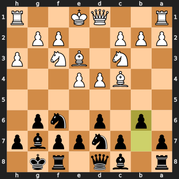


And now you give it straight back. The right move here is 7...e5, fighting for central space immediately. After 7...e5 dxe5 dxe5, the position normalises and you're doing fine in a standard King's Indian middlegame. Instead, 7...b6 prepares the fianchetto on the queenside (...Ba6 or ...Bb7) — thematic in a broader sense, but in this specific position it just lets White consolidate with a dominant centre. The eval jumps from +0.60 back up to +2.22. Three moves in a row, the game has swung by over a pawn and a half in alternate directions.

### 8. Ng5

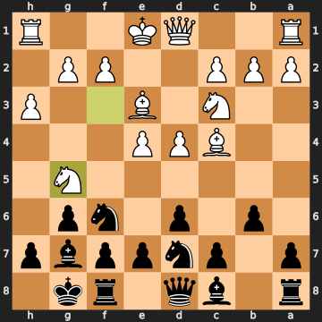


And here White blunders. After building a sizeable advantage, jasonbounds lunges the g5-knight forward in an apparent attempt to threaten f7. But the knight on g5 is exposed and White hasn't castled — the engine shows this costs over two and a half pawns of advantage. The correct move was 8. e5, which after 8...Ne8 9. e6 fxe6 10. Ng5 would have maintained real attacking pressure. Instead, 8. Ng5 is an aggressive lurch that turns a winning position into a slightly worse one: the eval flips from +2.22 to -0.31. White goes from winning to losing in a single move.

**8...Bb7** — Best. You develop the bishop to its ideal diagonal, and crucially, the g5-knight now has only one safe retreat square: f3.

### 9. Qf3

White brings the queen out early to f3. The problem is twofold: the queen is out before the king has castled, and Qf3 also blocks the f-pawn's natural advance — an important attacking lever in these positions. The engine preferred h4, which is the consistent follow-up to the Ng5 idea: push the h-pawn, try to generate a kingside attack, give the knight some support. After 9. h4 h6 10. h5, White at least has a chaotic position. Qf3 achieves nothing concrete and costs another half-pawn.

**9...e6** — Good solid play, controlling d5 and preparing to kick the g5-knight. After this, that knight has *no* safe retreat square — it's effectively trapped. The e6 pawn closes the diagonal for your own Bb7, but that's a temporary inconvenience; the knight is the more pressing issue.

### 10. d5

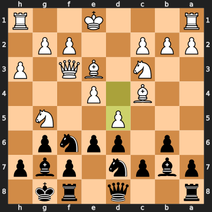


A second consecutive mistake from White. Jasonbounds pushes d5, apparently trying to gain space and open the position for the bishop, but this costs over a pawn of advantage. The right approach was again 10. h4 — providing some support for the marooned g5-knight while still keeping options. After 10. d5, the position worsens to -2.10 for White. That g5-knight remains a serious liability, and now you have a concrete reply.

### 10...e5

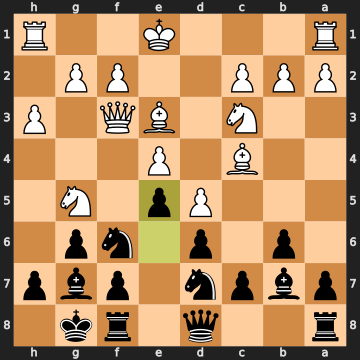


Here is your missed shot of the game, and it's the one I want to explain carefully. The engine's top choice is 10...Ne5, and it's a double attack: the knight on e5 simultaneously attacks White's queen on f3 *and* the bishop on c4. Both pieces are hit in one move. White has to respond to two threats at once — there's no clean way to save both. After 10...Ne5 11. Qe2 h6, the g5-knight is now trapped (no retreat), and after 11...hxg5, you've won the g5-knight for free. The eval is -2.10 — you're clearly winning.

Instead you played 10...e5, which is the "standard King's Indian centre-closing move." Completely understandable — this is your plan, this is what the King's Indian is *about*, and that plan-following instinct is strong. But in this specific position, with the knight trapped and the queen and bishop aligned for a fork, the concrete tactic was available and winning. The eval swings back to +0.36 for White after 10...e5. Missing ...Ne5 cost you most of the advantage you had just been given.

The lesson to take: when your pieces are visually aligned like that — knight able to land on a square that attacks two of the opponent's pieces simultaneously — check for that fork before playing the "thematic" plan move. The shape to notice is: can my knight land on a square where it hits the queen AND another piece in one jump? Here, Ne5 did exactly that.

### 11. Bb5

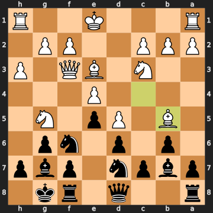


White continues making things worse. The engine wanted h4 here, desperately trying to give that g5-knight a lifeline. Instead jasonbounds plays Bb5, pinning your d7-knight against the king — a natural-looking move, but it doesn't actually achieve much. The g5-knight remains without a safe square. Eval is now -1.15.

### 11...Nb8

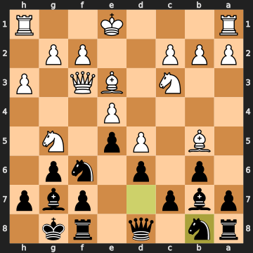


Interesting decision. You retreat the d7-knight to b8, apparently to dodge the pin and prepare to reroute. The engine preferred 11...a6, immediately challenging the Bb5. After 11...a6 12. Be2 b5, you'd be pushing the queenside pawns forward energetically while the g5-knight still has no retreat. Your ...Nb8 is a thematic King's Indian retreat — you've seen this idea before (Nb8-d7 is a standard regrouping in the KID, or routing to c6 or e6) — but it does lose a tempo compared to the more forcing a6. The eval swings back from -1.15 to +0.27. Still, this is a very human and recognisable move: you're "tidying up" rather than striking while White is most vulnerable.

### 12. O-O

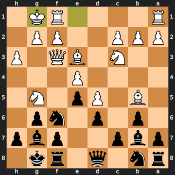


This is a costly blunder for White. The engine screamed h4 on moves 9, 10, 11, and 12 — jasonbounds has repeatedly declined to use the h-pawn as a lifeline for the stranded g5-knight, and now he castles kingside. The problem is that this places the king *toward* the action while the g5-knight is still hanging out with no retreat square. The eval crashes from +0.27 to -2.41 — over two and a half pawns' swing in one move. The consistent h4 was the only way to keep things playable; by castling kingside, White compounds the knight problem and surrenders the advantage for good.

**12...a6** — Best, and clean. You challenge the Bb5 immediately. Now the knight on g5 truly has no retreat and Black is firmly in charge.

### 13. a4

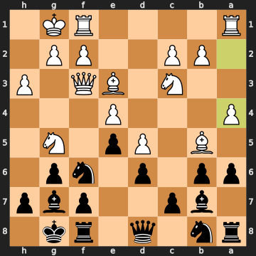


Still avoiding the bishop retreat. The engine wanted 13. Be2, beginning the process of untangling, allowing the g5-knight to retreat to f3 if needed. Instead 13. a4 is a queenside pawn push that doesn't address the core problem at all. The eval deepens to -3.28.

**13...axb5** — Naturally, you snap off the Bb5. After 13...axb5 14. axb5, you've traded bishop for pawn, coming out a clean bishop ahead. Material is now -3.0 in pawns (Black has bishop vs. pawn advantage in material terms — you're up a bishop for nothing meaningful).

**14. axb5 —** White captures back.

### 14...Nbd7

You re-develop the b8-knight to d7. The engine slightly preferred the immediate 14...h6, finally kicking the g5-knight now that the a-file rook trade is coming. After 14...h6 15. Rxa8 Bxa8 16. Ra1, you'd be winning that knight. Your 14...Nbd7 is still fine — just a slightly slower path. The key thing is that g5-knight remains without a retreat.

**15. Rxa8 Bxa8** — White exchanges on a8, you capture the rook with the bishop. Simple material accounting: you've traded a rook for a rook and kept the extra bishop from the earlier exchange.

### 16. Rb1

White plays Rb1, parking the rook on the b-file. The engine preferred Qe2, which would finally give the g5-knight a retreat via f3 (vacating f3 as a flight square). After 15. Qe2, White at least has some coordination. Rb1 doesn't solve the knight problem and the eval slips further to -3.73.

### 16...Re8

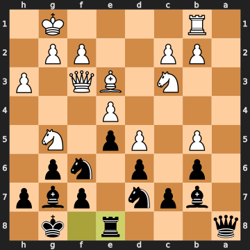


Here's where you make a more costly error. The best move is 16...h6, finally trapping the g5-knight permanently: after 16...h6 17. Qd1 hxg5 18. Ra1 Qb8, you've just won a piece. The g5-knight has been sitting on g5 with no retreat since move 8 — and ...h6 is the move that collects it. Instead you played 16...Re8, which is a solid defensive move (over-protecting e6, keeping an eye on potential Nxe6/dxe6 ideas), but it lets White escape. The eval recovers from -3.73 back to -2.58. You were that close to winning a whole piece for free.

This is a classic case of fixation on prophylaxis over exploitation. The Re8 idea is completely understandable — you're thinking about your king safety, about not letting White get counterplay via the centre. But the g5-knight was *hanging*. h6 was the move. The pattern to notice for future games: when an enemy piece has been trapped with no retreat for several moves, the priority is to *collect it* before your opponent finds a way to rescue it.

### 17. Qe2

White plays Qe2. The engine preferred Qd1, which would have at least kept the position calmer, but Qe2 is thematic — it finally gives the g5-knight a flight square on f3. Moving the queen away from f3 vacates that square as a retreat, quietly defusing the trapped-knight problem. Too late to save everything, but a step in the right direction for White.

**17...h6** — Best. Now you do hit the knight. And after White's response...

**18. Nf3** — The knight retreats to f3, escaping. White has finally wriggled free of the knight trap at the cost of a somewhat disorganised position.

### 18...Rd8

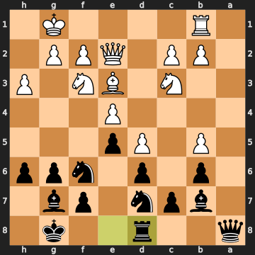


Another miss of the same type. The engine's top choice is 18...Nxe4 — winning the e4-pawn outright. After 18...Nxe4 19. Nxe4 (forced) Bxd5 (winning the d5-pawn too!) 20. Ng3 Be6, you've collected two pawns and still have a winning position. The calculation: ...Nxe4 takes the e4-pawn (+1); Nxe4 recaptures (net: knight-for-knight, equal trade on that exchange); but then ...Bxd5 wins the *d5-pawn* as well, since the e4-pawn that was helping defend d5 is now gone. Net: you come out two clean pawns ahead from a single tactical sequence.

Instead you played 18...Rd8, which is a natural-looking rook centralisation, but it doesn't capitalise on the available material. Eval slips from -3.28 to -2.32. This is the second time in the game you've had ...Nxe4 available and declined it.

The pattern here: you're already up material (a bishop), so grabbing another pawn or two might feel greedy or complicated. But being up a bishop and two pawns versus up a bishop alone is a very different winning percentage. When the material is there, take it.

### 19. b4

White pushes b4, apparently trying to generate queenside counterplay. The engine preferred Qd1, just consolidating. The eval worsens further to -2.92.

**19...Rf8** — Good, keeping the f-file rook active.

**20. Qd1** — White retreats the queen.

### 20...Qb8

You play Qb8. The engine's top choice here is Qa3, which would swing the queen aggressively toward White's queenside: after 20...Qa3 21. Rb3 Qa7, you're bearing down on the b4-pawn and keeping active pressure. Qb8 is still fine — you're consolidating, watching the b5-pawn, and the eval only dips slightly from -2.86 to -2.52. But Qa3 was the more active, pressing choice.

**21. Ra1 Kh7** — You tuck the king to h7 with Kh7 — good prophylaxis, covering g6 and h6, keeping the king slightly away from the back rank while the position develops.

**22. Nh4** — White repositions the f3-knight to h4, perhaps eyeing a jump to f5 or g6. The knight on h4 has only one safe retreat square (f3), so this is a slightly risky manoeuvre.

**22...Ng8** — A patient retreat, pulling the knight back to g8 to prepare ...f6, planning to push the f-pawn and establish firm control over the kingside squares. The h4-knight is now vulnerable to being kicked.

### 23. Qf3

Qf3 again — the queen returns to f3 for the second time in the game. This time the plan is presumably to combine with Nh4 for kingside threats, but the queen on f3 has appeared before and accomplished little. The engine preferred Ne2, regrouping more quietly toward the kingside. The eval slips to -3.16.

### 23...Bf6

You play Bf6, activating the g7-bishop at last and aiming it at the h4-knight (which after this move has *no* safe retreat square — it's trappable). The engine's first choice was Qd8, maintaining pressure via different means. Bf6 is an inaccuracy in the technical sense — it allows White's Nf5 on the next move — but the intuition behind it is sound: you're activating your most passive piece (the g7-bishop has been somewhat idle) and creating real threats. Your position remains very comfortable.

**24. Nf5** — White plays the best move, jumping to f5 before you can trap the h4-knight. This is the correct response.

**24...Re8** — Reasonable, keeping an eye on the e6-square.

### 25. Nxh6

Now White attempts a piece sacrifice. Jasonbounds captures on h6 with the f5-knight, winning a pawn and exposing your king. This looks dramatic, but the engine flags it as an unsound sacrifice — White was already down material and this doesn't generate enough compensation. After 25. Ng3 (the safer choice), White would have stayed approximately where they were at -2.55. By taking on h6, White gives up a piece for a pawn with no concrete attack to show for it. The eval drops to -3.10. This is the pattern you mentioned about speculative piece sacrifices at club level: it looks scary, it feels like an attack, but when the king just sidesteps to g7 and captures the knight, there's nothing behind it.

**25...Nxh6** — You capture the knight cleanly. Material is now: you're down about four pawns' worth in raw material (you gave up bishop and a rook earlier, you've been gaining back), but the position is winning.

### 26. Bxh6

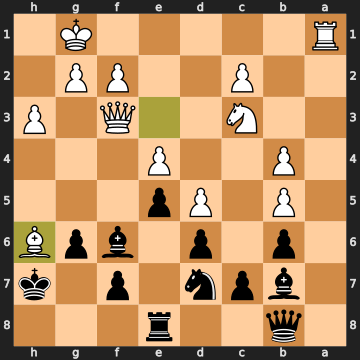


White captures on h6 with the bishop. The engine preferred 26. g4, keeping the position more solid and avoiding further material loss. After 26. Bxh6 Kxh6, the h-file opens and you're a full piece up.

### 26...Kxh6

The only move, and the right one. You capture the bishop, coming out a clear piece up. The eval is -4.01. White's sacrifice has yielded nothing — just a pawn for a bishop, with your king slightly exposed but quite safe. The h-file is half-open for you now, and your winning advantage is concrete.

**27. Qe3+ Kg7** — White checks, you step back to g7. Forced and fine.

**28. Qg3 Rh8** — White repositions the queen to g3; you swing the rook to h8, pointing down the half-open h-file.

### 29. Qg4

White plays Qg4, trying to apply pressure on the kingside. The engine preferred Ne2, but Qg4 isn't terrible — it's just not addressing the structural deficit. The eval deepens to -4.81.

**29...Nf8** — Good, redeploying the g8-knight to f8, where it defends and prepares ...Ne6 or ...Nh7.

**30. Nd1 Rh4** — White shuffles the knight; you slide the rook to h4, a menacing square on the fourth rank.

### 31. Qf3

White retreats the queen to f3 for the third time. The engine preferred Qe2. The pattern of the queen bouncing back to f3 repeatedly suggests White is uncertain about where it belongs — Qf3 keeps the queen central but doesn't solve anything.

**31...Rf4** — You bring the rook to f4, threatening to become very active.

### 32. Qg3

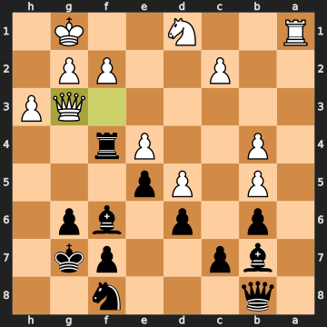


White plays Qg3. The engine preferred Qd3, which would have been a slightly better defensive setup. Qg3 lands the queen on the g-file, and here is where the seed of your late-game plan starts to germinate.

**32...Bh4** — You chase the queen with the bishop, forcing it to move.

### 33. Qe3

White retreats to Qe3. The engine preferred Qd3 again.

**33...Nh7** — You reroute the f8-knight toward the kingside via h7, intending Ng5. There's a fork waiting here you should know about: your rook is on f4 and your bishop has moved to h4 — both sitting on the fourth rank, both on light squares. White's g3 pawn fork hits both of them. You allow it with 33...Nh7, and White plays it on the next move.

### 34. g3

White plays the best move, g3, forking the rook on f4 and the bishop on h4. Both pieces are attacked simultaneously. This is a genuine double attack — the pawn on g3 physically attacks both f4 and h4 in one move.

### 34...Bxg3

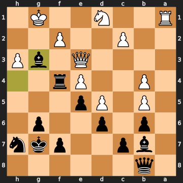


Here's the mistake. You capture on g3 with the bishop rather than moving the rook to f6 with 34...Rf6. Let's think about what 34...Rf6 accomplishes: after 34...Rf6 35. gxh4 Rf4 36. Qg3 Nf6, you've kept the bishop, traded off White's g3-pawn, and still have an h4-rook on the board. You'd remain around -3.72. By capturing with 34...Bxg3, you allow White to recapture on g3 and the position tightens somewhat — the eval rises from -3.72 to -2.74 after the capture.

The instinct to capture the g3-pawn (it's hanging!) is very natural. But the bishop was more valuable than the pawn — retreating the rook to f6 and letting White take on h4 was the correct sequence. You were winning with or without the pawn; the bishop was your active attacker.

### 35. Qxg3

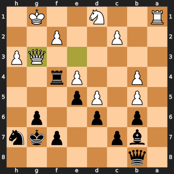


White recaptures on g3 with the queen. The engine preferred fxg3 — capturing with the f-pawn would have left the g-file half-open for White and kept the queen on a better square. After fxg3, White is objectively less bad than after Qxg3. But crucially: after Qxg3, the queen is now on the g-file. White's king is on g1. The queen is on g3. The g-file is opened. This is the setup for what you spotted.

**35...Nf6** — Best. The eval is -4.34.

### 36. Nc3

White plays Nc3. The engine preferred f3 first. Minor issue in a losing position.

**36...Nh5** — You push the knight toward the kingside, eyeing Ng3 or Nf4.

### 37. Qg5

White plays Qg5. This is actually the engine's top choice, and it creates a real double attack — the queen on g5 simultaneously attacks the rook on f4 and the knight on h5. White sees the threat and creates genuine counter-pressure.

**37...f6** — You chase the queen with f6, forcing it to move. Natural and fine.

**38. Qg2 Bc8** — White retreats to Qg2; you reorganise the bishop back to c8. Notice what's happening: the White queen is now on g2, the White king is on g1. Both on the g-file.

**39. Ne2 Rh4** — White repositions the knight; you swing the rook back to h4, eyes on the kingside.

### 40. Ng3

White plays Ng3, putting the knight on a square that, it turns out, can be immediately captured.

**40...Nxg3** — You take the knight. Correct and fine.

### 41. Qxg3

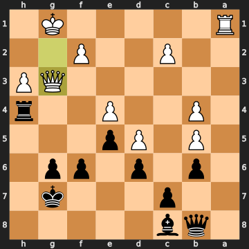


Here White recaptures with the queen (not the f-pawn). The engine again preferred fxg3 for the same reason as move 35: fxg3 would keep the g-file relationship between king and queen different. By playing Qxg3, the White queen is again on g3 — with the king on g1. Both on the g-file. The pattern is repeating.

**41...Rxh3** — You collect the h3-pawn cleanly, bringing material in.

**42. Qg2 Bd7** — White retreats the queen to g2 (king g1, queen g2, same g-file); you develop the c8-bishop to d7, activating it and eyeing the b5-pawn.

### 43. f3

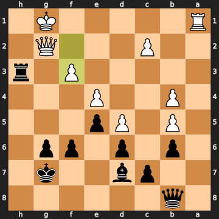


White pushes f3 — probably trying to establish a defensive barrier — but the engine preferred something like Rd1 to keep the rook active. The eval deepens to -6.46.

**43...Rh5** — You slide the rook to h5. Good. The pressure is building.

### 44. c3

White plays c3. The engine preferred c4, attempting more active play. The eval is now -6.32.

**44...Rg5** — And here it is. You swing the rook to g5, and now White's king on g1 and queen on g2 are *both on the g-file*, with your rook bearing down the g-file from g5. The king and queen are skewered. If the queen doesn't move, the rook takes it; if the queen takes the rook, you recapture with the f-pawn and come out material ahead. This is the tactic you saw — and you said it yourself in your note: you noticed White's king and queen were both on the g-file and brought the rook to pin them.

Give yourself credit for seeing this. This required foresight: noticing the alignment of White's king and queen on the g-file, realising your rook could swing to g5 to exploit it, and correctly identifying that Qxg5 fxg5 would leave you material ahead. That's not luck — that's board vision.

### 45. Qxg5

White captures the rook on g5. The engine actually preferred Kf2 here, which would have moved the king off the g-file and kept the queen, though the position is utterly lost either way. By taking on g5, White collects the rook but hands you the queen.

### 45...fxg5

You capture the queen with the f-pawn. This is the correct, winning capture. Notice what the engine shows here: one of the alternatives was 45...Qh8 (which leads to a drawn position, +0.00) or even 45...c5 (which is actually slightly *losing*). Only 45...fxg5 is the full winning move. You found it. Material count: White has collected the rook but lost the queen — net result, you're down a rook and a bishop versus the queen, but now with a clear extra queen's worth of material over the board. The eval is -7.16.

### 46. Kf2

White plays Kf2. The engine preferred c4, looking for active counterplay.

**46...Bxb5** — You collect the b5-pawn. Still winning, still +/- 6.54.

### 47. Rg1

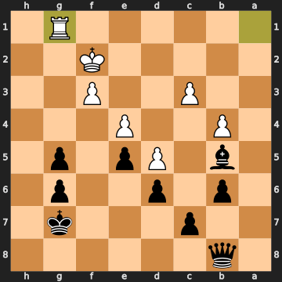


White plays Rg1. The engine preferred c4 here, trying to generate some queenside activity. Rg1 is passive.

**47...Kf6** — You centralise the king.

### 48. Ke3

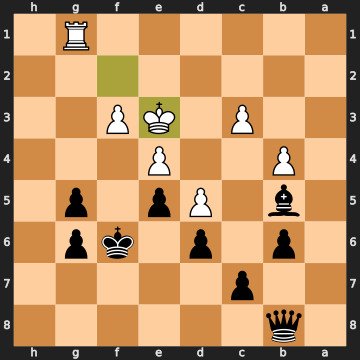


Another mistake from White. The engine wanted Ra1, trying to activate the rook. After 48. Ke3, the king walks toward the centre and toward danger.

**48...Qh8** — Excellent. You swing the queen to h8, targeting the g-file from the back rank.

### 49. Rg3

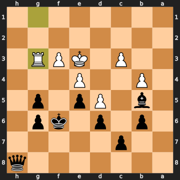


A decisive blunder. White plays Rg3, placing the rook on the g-file. The engine shows that Kf2 (or Kd2 or c4) were all still losing, but they at least extended the game. Rg3 is the move that allows immediate forced mate in four.

### 49...Qh2

Now this is the move. You play Qh2 — the queen slides to h2, attacking the g3-rook directly, and creating a mating threat. The eval is mate in three.

### 50. Rg4

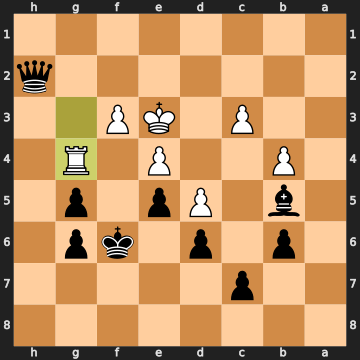


White moves the rook to Rg4. The engine confirms that Rg2 would have given the same result (mate in three), and f4 allows immediate mate in one (50. f4 Qe2#). In fact, 50. Rg4 allows mate in one on the very next move.

### 50...Qe2#

And there it is. The queen drops to e2 and it's checkmate. The white king on e3 is surrounded — the queen on e2 covers d1, f1, and d3; the rook on g4 blocks f4; the pawn structure closes off other escapes. Mate.

Your opponent, as you mentioned, deliberately allowed the mating move rather than playing on hopelessly or resigning. A gracious gesture, and well-deserved on your part — you'd earned a clean finish.

---

## Closing Reflection

This was a genuine 890-level rapid game, which means it was full of missed tactics in both directions — and that's completely normal and human at this time control and rating. What distinguishes JamesTortoise's play is the pattern that emerges over the full fifty moves: you played your plan consistently, converted your material advantages when they came, and in the endgame you demonstrated real board vision in spotting the king-queen alignment and setting up the rook to exploit it. The finish — queen to e2, checkmate — was earned and deliberate.

The areas to focus on going forward are the ones you already know about: twice in this game you had 6...Nxe4 and 18...Nxe4 available and passed on them, both times because the pawn grab felt like a detour from the King's Indian plan. The lesson isn't to abandon the plan — it's to train the habit of asking "is there a free piece or pawn right now before I play the thematic move?" Similarly, the g5-knight was sitting undefended from move 8 through move 17, and ...h6 to trap it was available much earlier. You got there eventually, but developing the habit of spotting and collecting those trapped pieces immediately is worth practising. Your instinct toward clean, positional play is a genuine strength; calibrating it with tactical alertness will take your game to the next level.

---

## Other key positions

**50... Qe2#** (best)

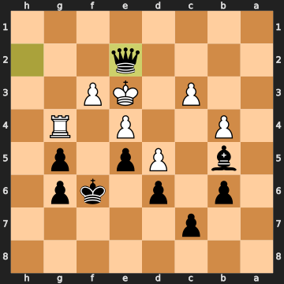

