# Andrei Volokitin vs. Vassily Ivanchuk — Aerosvit GM Tournament (2006.06.25)

- **White:** Andrei Volokitin
- **Black:** Vassily Ivanchuk
- **Result:** 0-1
- **ECO:** B03
- **Opening:** Alekhine Defense, Exchange Variation

## Moves (for reference)

```
1. e4 Nf6 2. e5 Nd5 3. d4 d6 4. c4 Nb6 5. exd6 exd6 6. Nc3 Be7 7. h3
O-O 8. Nf3 Bf6 9. Be2 Be6 10. d5 Bxc3+ 11. bxc3 Bd7 12. O-O Na6 13.
Bg5 f6 14. Be3 Nc5 15. Re1 Re8 16. Bf1 Re7 17. Nd4 Qf8 18. Nb5 Bxb5
19. cxb5 Rae8 20. a4 f5 21. a5 f4 22. Bd2 Rxe1 23. Bxe1 Nbd7 24. f3
Qf6 25. Rc1 b6 26. axb6 axb6 27. Bf2 h6 28. Bd4 Qg5 29. c4 Nf6 30. Ra1
Nh5 31. Ra7 Qe7 32. Qc2 Ng3 33. Ra1 Qg5 34. Kh2 Kf7 35. Kg1 Nd7 36.
Kh2 Ne5 37. Bf2 Ng6 38. Bd3 Nh4 39. Ra7 Re7 40. Ra8 Ngf5 41. Bf1 Ne3
42. Bxe3 fxe3 43. Qe2 Nf5 44. Ra2 Qf4+ 45. Kg1 Qd4 46. Kh2 Qe5+ 47. f4
Qxf4+ 48. Kg1 Ng3 49. Qd3 Re4 50. Be2 Rd4 51. Qb1 Rd2 0-1
```


## Evaluation across the game

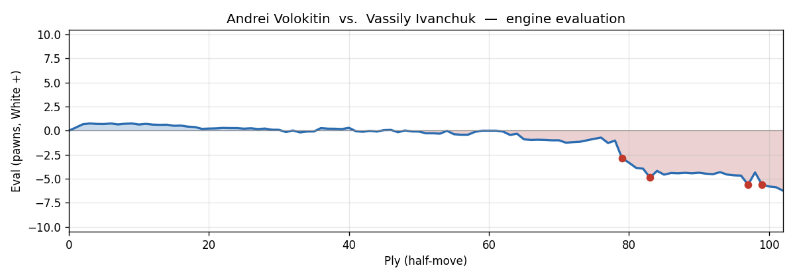

---

## Cold open

A Ukrainian prodigy faces one of the most creative minds in chess history — and Vassily Ivanchuk, the mercurial genius from Lviv, spends forty moves quietly building a position that looks roughly equal, then conjures a knight sacrifice out of nowhere and proceeds to dismantle White's entire position like a man who already knows the ending. Feel free to pause at move 40 and see if you can find what Ivanchuk found. I suspect you'll need more than a few seconds.

[SCENE BREAK]

## Opening narrative

The Aerosvit tournament in 2006 was one of the strongest round-robin events of its era, and here we have Andrei Volokitin, the brilliantly gifted young Ukrainian grandmaster, sitting behind the white pieces against Vassily Ivanchuk — arguably the most imaginative, unpredictable player in the world at the time. You're a fan of the Alekhine's Defence, so this game is right in your wheelhouse: Ivanchuk goes for **1...Nf6**, provoking White's e-pawn forward in the classic Alekhine spirit of inviting aggression and then dismantling it.

Volokitin steers the game into the Exchange Variation — **5. exd6** — a line designed to immediately defuse the central tension by trading the advanced pawn, leaving Black with a small but real structural question of how to recapture and develop. It's a solid, slightly dry choice against the Alekhine, favoured by players who prefer quiet positional pressure over the chaos of the Four Pawns Attack. The resulting position is balanced and a little cramped for Black, with doubled White c-pawns as partial compensation for Black's bishop pair.

For thirty-nine moves the game is, frankly, a slow, high-level squeeze — both sides maneuvering, White holding a microscopic advantage that never quite becomes anything, Black gradually untangling. Then Ivanchuk plays a move that changes everything. That's what we're here for.

[SCENE BREAK]

## Move-by-move walkthrough

**1. e4** — the most popular move in chess, staking a claim in the centre. **1...Nf6** — and there it is. The Alekhine's Defence: Black doesn't contest the centre conventionally but *provokes* the e-pawn to advance, planning to undermine it later.

**2. e5** attacks the knight. **2...Nd5** retreats to the ideal square, eyeing c3 and the centre. **3. d4** reinforces the e-pawn chain. **3...d6** immediately challenges it. **4. c4** kicks the knight again. **4...Nb6** retreats once more — the knight has now moved twice in the opening, but in the Alekhine this is the *point*, not a mistake. White's pawns look impressive; Black's plan is to blow them apart.

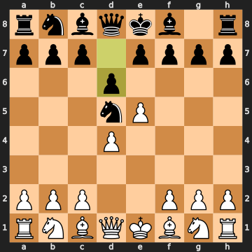


### 5. exd6

**5. exd6** is the Exchange Variation — White voluntarily trades the advanced pawn rather than defending it. It does leave White with doubled d-pawns after the recapture, but it also opens lines and denies Black the thematic pawn-undermining play. All of this is well within established theory through this point.

**5...exd6** — Ivanchuk recaptures with the e-pawn, opening the e-file and giving the dark-squared bishop access to e6. The alternative **5...cxd6** was the engine's slight preference, keeping the c-file closed, but both moves are entirely theoretical.

**6. Nc3 Be7 7. h3** — White develops the knight and plays the useful prophylactic **h3**, preventing a future **...Bg4** pin on the f3-knight. It's not the most aggressive choice, but it's sensible preparation. **7...O-O** — Ivanchuk castles. **8. Nf3** finishes the minor-piece development, and **8...Bf6** brings the bishop to an active diagonal.

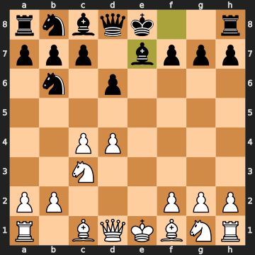


**9. Be2** is slightly passive — the bishop on e3 was marginally preferable — but perfectly reasonable. **9...Be6** is the best reply, activating Black's dark-squared bishop while also opening c8 as a potential retreat square for the b6-knight, which a queenside pawn advance might otherwise hassle.

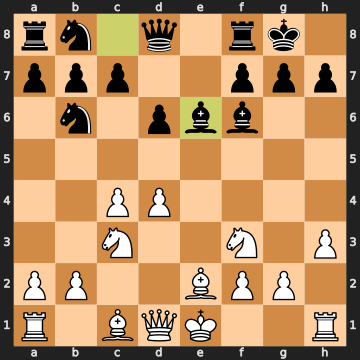


### 10. d5

**10. d5** — Volokitin kicks the e6-bishop with a space-gaining advance. It makes sense positionally: White claims more central space and forces Black to clarify the bishop's future. The engine preferred **10. Qb3** with slightly more bite, but **d5** is a natural and human move.

### 10...Bxc3+

**10...Bxc3+** — Ivanchuk immediately gives up the bishop for the c3-knight. This is a key theoretical decision: in exchange for the bishop pair disadvantage, Black ruins White's c-file pawn structure. After...

### 11. bxc3

**11. bxc3** is the only recapture worth considering — **Kf1** drops nearly a pawn of advantage and **Nd2** is a catastrophic –3.67. Taking back with the b-pawn is simply forced. Now White has tripled-looking pawns on c3, c4, and the d5 outpost, but they're also passed and space-gaining. The e-file is open, which matters.

**11...Bd7** — the bishop retreats to support queenside play. **12. O-O** — Volokitin castles. **12...Na6** — the knight heads toward c5, a lovely outpost square.

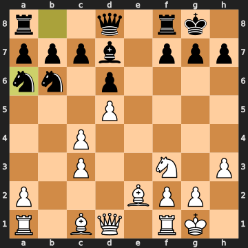


**13. Bg5** develops with tempo, attacking the queen. **13...f6** chases it away. **14. Be3** retreats to e3, now attacking the b6-knight. **14...Nc5** — the knight lands on c5 with a threat to the e3-bishop, and simultaneously eyes d3. Both knights are now beautifully centralised.

**15. Re1** — a natural rook move to the open e-file. **15...Re8** brings the rook to e8, eyeing the e3-bishop again. **16. Bf1** — the bishop retreats. **16...Re7** — doubling purposes, and still eyeing e3. **17. Nd4** — centralising the knight. **17...Qf8** — a waiting, flexible queen move, stepping off the dangerous d-file. **18. Nb5** — the knight lunges to b5 with energy.

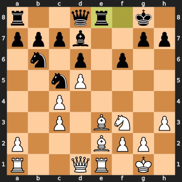


### 18...Bxb5

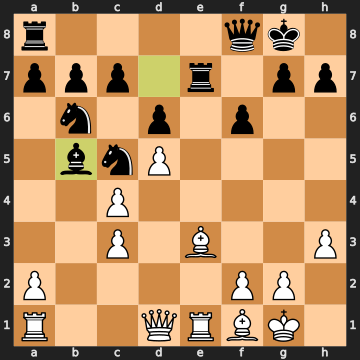


**18...Bxb5** — Ivanchuk trades the bishop for the b5-knight, giving up the bishop pair. The engine preferred **18...Be8**, quietly retreating and keeping things roughly equal at –0.08. **Bxb5** cedes a small positional concession — after the c-pawn recaptures, White gains the b5-pawn and some queenside space — swinging the eval back slightly in White's favour. It's not a disaster, just a small inaccuracy in a game otherwise marked by extremely fine play from both sides.

### 19. cxb5

**19. cxb5** — forced and correct. Any other recapture is catastrophically worse, as the alternatives show. After **cxb5**, White has a mobile queenside pawn majority and Black must find active counterplay quickly.

**19...Rae8** — both rooks on the e-file, building pressure. **20. a4** — White starts advancing the queenside majority. **20...f5** — Black pushes, claiming space on the kingside and threatening to advance further.

### 21. a5

**21. a5** — Volokitin chases the b6-knight with another pawn advance. The engine preferred **21. Re2**, just quietly improving the rook and maintaining the slight advantage at +0.30. The **a5** push looks natural but it essentially gives Black the f4 advance for free, and — crucially — it triggers the kingside counterplay that will eventually cost White the game. The eval swings from +0.30 to –0.06: a 36-centipawn inaccuracy that marks the first real turning point.

**21...f4** is immediately the best response — attacking the e3-bishop.

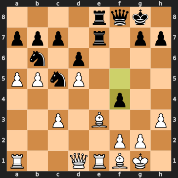


**22. Bd2** — the bishop retreats sensibly. **22...Rxe1** — Black snaps off the rook.

### 22...Rxe1

Wait, let me slow down here, because this move is more interesting than it first appears. The rook on e1 sits on the same rank as the white queen on d1 AND the white bishop on f1. When Ivanchuk plays **22...Rxe1**, it attacks both the queen on d1 AND the bishop on f1 simultaneously — a genuine double attack. White can't save both. The position has quietly been building to this moment: Ivanchuk spotted that the pieces on d1 and f1 were both hanging on the first rank and cashed in.

### 23. Bxe1

**23. Bxe1** is the only good reply — **Qxe1** drops the rook on e8 immediately, and **axb6** loses the queen outright. Taking with the bishop keeps the material roughly even. After **23...Nbd7**, both sides have untangled somewhat and the position is roughly balanced.

**24. f3** — White tries to stabilise the kingside. **24...Qf6** — Black's queen comes to a more active diagonal. **25. Rc1** — rook to the c-file. **25...b6** — Ivanchuk strikes at the queenside pawns immediately.

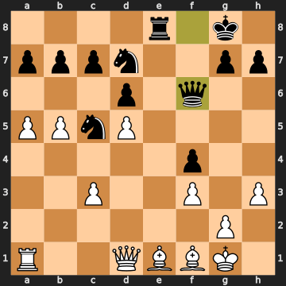


**26. axb6** — White captures, creating doubled pawns on the b-file. **26...axb6** recaptures. **27. Bf2** — the bishop retreats to f2, attacking the c5-knight. **27...h6** — a useful prophylactic move, and the eval is essentially dead even.

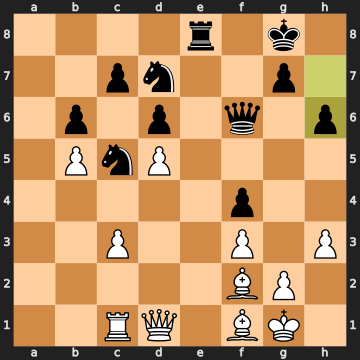


### 28. Bd4

**28. Bd4** — on paper this looks like a nice double attack on the queen on f6 and the knight on c5. And it IS a double attack — **Bd4** hits both simultaneously. But the engine's preference was **28. Ra1**, playing for the open a-file at nearly zero cost. Why is **Ra1** better? Because after **28...Qg5**, Ivanchuk sidesteps the "double attack" entirely with no damage — you can see that the queen just slides away from f6 to g5. So the "double attack" was somewhat illusory: Black had an easy escape. The eval confirms this, slipping from –0.01 to –0.37 after Ivanchuk's response.

**28...Qg5** — and indeed, the queen sidesteps.

**29. c4** — White advances the c-pawn. **29...Nf6** — the knight comes back toward the centre. **30. Ra1** — finally getting the rook to the open a-file. **30...Nh5** — the knight maneuvers.

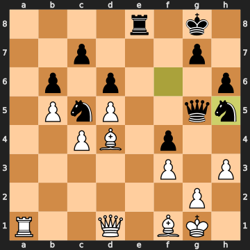


**31. Ra7** — the rook invades the seventh rank aggressively. **31...Qe7** — Ivanchuk sensibly steps off.

### 32. Qc2

**32. Qc2** — this looks natural, eyeing the queenside, but the engine preferred **Qb1**, which immediately defends against the coming **...Ng3** threat and maintains the balance at –0.09. With **Qc2**, White allows Ivanchuk to immediately play...

**32...Ng3** — the knight comes to g3, attacking the f1-bishop. White is already slightly uncomfortable.

### 33. Ra1

**33. Ra1** — Volokitin retreats the rook rather than trying **Qg6**, which the engine identifies as significantly better. Why is **Qg6** superior? It attacks both the rook on e8 and the knight on g3 simultaneously — a queen fork that would force Black to deal with two threats at once. After **Qg6 Nxf1 Rxc7 Nd7 Rxd7**, White is fighting for survival but at only –0.32. Instead **Ra1** lets the eval slide to –0.90. A meaningful missed opportunity.

**33...Qg5** — Black's queen takes up a dominant central post. **34. Kh2** — White's king steps away from the g3-knight's influence, also attacking it. **34...Kf7** — Ivanchuk walks his king toward the action — a subtle and strong maneuver, activating the king for the coming endgame/attack.

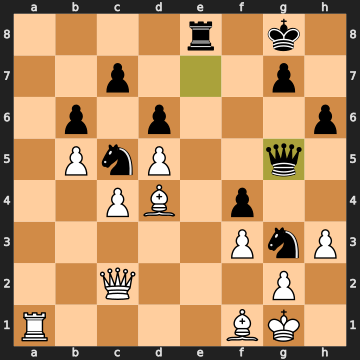


**35. Kg1 35...Nd7** — both sides regroup. **36. Kh2** — White's king walks back and forth, a sign of uncertainty.

**36...Ne5** centralises the knight. **37. Bf2** — finally dealing with the g3-knight threat. **37...Ng6** — the knight retreats. **38. Bd3** attacks it again. **38...Nh4** — and it slinks back to h4, setting up something.

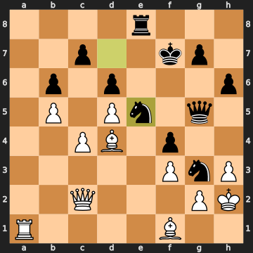


### 39. Ra7

**39. Ra7** — back to the a7-invasion, but this is actually an inaccuracy at a critical moment. The engine prefers **39. Qa2**, eyeing the e-file and the e3-pawn complex. The position is drifting, and the rook move doesn't address what's coming. The eval moves from –0.72 to –1.28. White is sliding.

**39...Re7** — Ivanchuk expels it. **40. Ra8** — here we go.

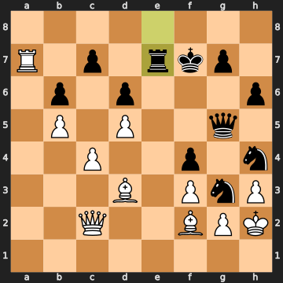


### 40. Ra8

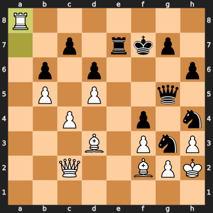


**40. Ra8** is a genuine mistake — the first real turning point of the game. White goes for counterplay down the a-file, but this lands the rook in an awkward position and, more critically, leaves the kingside completely unattended. The engine's correct move was **40. Ra1**, retreating and playing **Nhf5 Bxf5 Qxf5 Qxf5+** — a forcing line that keeps the deficit around –1.03. Instead, the rook goes to a8 where it does essentially nothing, and the eval plummets to –2.86. White had an active defensive resource and played a passive invasion instead.

Now we arrive at the move of the game. Feel free to pause here. Black to play. Ivanchuk has a knight on h4 and a knight on g6 (from move 37's maneuver). His queen is on g5. White's rook is stranded on a8 and the king is on h2. What does Ivanchuk find?

[SCENE BREAK]

### 40...Ngf5

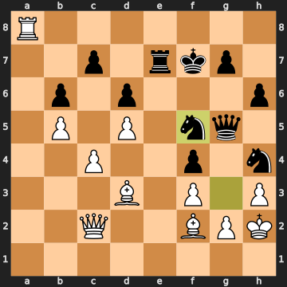


There it is. **!!**

**40...Ngf5** — Ivanchuk drops the g6-knight into f5, and at first glance this looks completely normal. But here's the thing: it's immediately offering the h4-knight to be taken by the d3-bishop. The line the engine confirms is **41. Bxh4 Qxh4** — and now if White recaptures, Black has a queen on h4 and a powerhouse knight on f5, with the rook on e7 joining. The engine values this at –3.33 in Black's favour.

What did Ivanchuk see? He saw that if White takes on h4, he gets a permanent knight on f5 and a dominating queen for only one knight — a classic piece sacrifice for activity and attack. The h4-knight was not really participating in the game; the f5-knight is untouchable and controls the whole board. He calculated that the compensation was overwhelming.

This is the mark of a world-class player: the willingness to offer a piece when you've seen the resulting position is winning, even if the material count says it shouldn't be. The knight on f5 cannot be dislodged, the rook on e7 will flood into the position, and White has no good replies. The evaluation goes from –2.86 to –3.33 — and it only gets worse for White from here.

### 41. Bf1

**41. Bf1** — Volokitin declines the sacrifice and retreats the bishop. It looks like he's avoiding the complications, but actually **Bxh4 Qxh4** was the *less* bad option at –3.33 compared to the –3.86 Black reaches anyway. Declining achieves nothing — the h4-knight can be kicked by a pawn advance but has only g6 as a safe retreat, meaning it's going to stay in the game regardless. White just burns a tempo.

### 41...Ne3

**41...Ne3** — and BANG. The f5-knight — which was created by the sacrifice — *immediately* forks the queen on c2 and the bishop on f1. Both pieces are under attack simultaneously. White cannot save both. This is the double attack that Ivanchuk saw when he played **40...Ngf5**: the whole sequence was preparation for this knight fork. That's the board vision on display — not just one move, but seeing that **Ngf5** would eventually plant a knight on e3 attacking two pieces at once.

The eval: –3.95. White is in serious trouble.

### 42. Bxe3

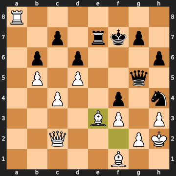


**42. Bxe3** — Volokitin captures the knight, but this is actually a mistake. The engine preferred **42. Qd3**, trying to keep more material on the board. After **Qd3 Nhxg2 Kh1 Nxf1 Qxf1**, White has given up the bishop and is down material but still fighting. Taking the knight on e3 doesn't improve matters — it gives Ivanchuk the open f-file and a passed pawn for no real benefit.

**42...fxe3** — Black recaptures. The engine's best was **42...Qg3+**, which was even stronger, but **fxe3** is still clearly winning, creating a powerful passed pawn on e3. Black is decisively better regardless.

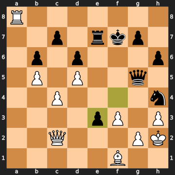


### 43. Qe2

**43. Qe2** — White tries to defend against the e3-pawn and keep the position together. It's the best remaining move, but Black is over four pawns better in evaluation. **43...Nf5** — the h4-knight springs to f5, joining the attack.

**44. Ra2** — the rook repositions defensively. **44...Qf4+** — check!

### 47...Qxf4+

**44...Qf4+** is a check AND a fork: the queen on f4 checks the king on h2 and simultaneously attacks the bishop on f1. That's two targets with one queen move. Volokitin's position is being systematically dismantled.

**45. Kg1** — the king retreats, forced. **45...Qd4** — the queen centralises with tempo, hitting various targets. **46. Kh2** — the king shuffles. **46...Qe5+** — another check, keeping the pressure on.

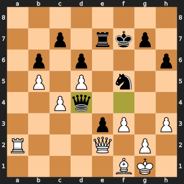


**47. f4** — White tries to chase the queen away. **47...Qxf4+** — Black takes the pawn with check AND hits the f1-bishop, a fork of the king and bishop. The position is collapsing.

### 48. Kg1

**48. Kg1** is forced — **Kh1** leads to **Ng3+ Kg1 Nxe2+** winning the queen, and **g3** is equally catastrophic.

### 48...Ng3

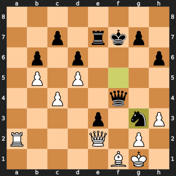


**48...Ng3** — the knight re-enters with a vengeance, now forking the queen on e2 and the bishop on f1 AGAIN. This is the second time in ten moves that Ivanchuk's knight has landed on g3 attacking two pieces simultaneously. It's not luck; it's a pattern Ivanchuk has been orchestrating.

### 49. Qd3

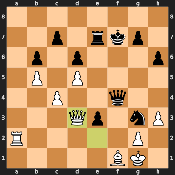


**49. Qd3** — Volokitin defends the f1-bishop by moving the queen, but this is a mistake. The correct defence was **49. Qe1**, which also defends both pieces but in a slightly more coordinated way, keeping the eval at –4.67. With **Qd3**, the queen is actually on a more exposed square.

**49...Re4** — Ivanchuk's rook enters the position on e4, eyeing the d4-bishop and generally increasing the pressure. The engine's quickest win was **49...e2**, pushing the passed pawn immediately, but **Re4** is still decisive.

### 50. Be2

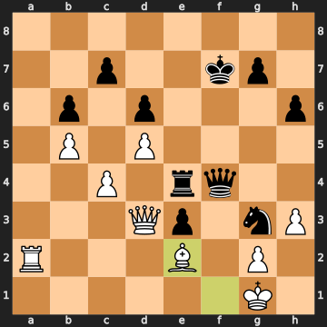


**50. Be2** — White finally activates the dormant f1-bishop, but the engine immediately flags this as a mistake despite it being the engine's own suggested move. Why? Because after **50...Rd4**, Black's rook attacks the queen on d3 AND the position has become completely untenable. The eval reaches –5.62. White is playing for tricks now.

**50...Rd4** — the rook comes to d4 with tempo, hitting the queen. **51. Qb1** — White tries to get off the exposed square and consolidate. Black is up a clean pawn with an overwhelming position, two connected passed pawns in the centre, and an active army.

And now — the final move of the game.

### 51...Rd2

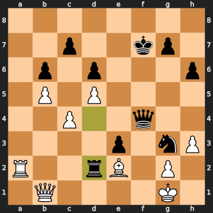


**51...Rd2** — a brilliant rook sacrifice, and the coup de grâce. The rook *dives into* the second rank, forking the rook on a2 AND the bishop on e2 simultaneously. After **Rxd2 exd2**, Black has a monster passed pawn on d2 that will queen, and the engine line confirms: **Bf3 Qd4+** and the pawn queens. There is no way to stop it. White cannot save both pieces AND deal with the passed pawn.

Volokitin resigned. The position is hopeless — material is pouring off the board and a queen is coming.

[SCENE BREAK]

## Outro

Here's what this game was, really. For thirty-nine moves, Ivanchuk played good, solid chess — never spectacular, never alarming, just quietly untangling and maneuvering until the position was almost even. And then, on move 40, he sacrificed a knight and played the next ten moves as if he had the whole thing memorised. The knight that forked the queen and bishop on move 41, the passed pawns on e3 and d2, the final rook dive on move 51 — none of these were accidents. They were consequences of a single decision: **Ngf5**, a move that only works if you've already seen the knight landing on e3 two moves later. That's not chess as calculation. That's chess as art. Ivanchuk wins by resignation.
