# Boris Spassky vs. Robert James Fischer — World Championship Match (1972.08.10)

- **White:** Boris Spassky
- **Black:** Robert James Fischer
- **Result:** 0-1
- **ECO:** B04
- **Opening:** Alekhine Defense: Modern, Alburt Variation

## Moves (for reference)

```
1. e4 Nf6 2. e5 Nd5 3. d4 d6 4. Nf3 g6 5. Bc4 Nb6 6. Bb3 Bg7 7. Nbd2
O-O 8. h3 a5 9. a4 dxe5 10. dxe5 Na6 11. O-O Nc5 12. Qe2 Qe8 13. Ne4
Nbxa4 14. Bxa4 Nxa4 15. Re1 Nb6 16. Bd2 a4 17. Bg5 h6 18. Bh4 Bf5 19.
g4 Be6 20. Nd4 Bc4 21. Qd2 Qd7 22. Rad1 Rfe8 23. f4 Bd5 24. Nc5 Qc8
25. Qc3 e6 26. Kh2 Nd7 27. Nd3 c5 28. Nb5 Qc6 29. Nd6 Qxd6 30. exd6
Bxc3 31. bxc3 f6 32. g5 hxg5 33. fxg5 f5 34. Bg3 Kf7 35. Ne5+ Nxe5 36.
Bxe5 b5 37. Rf1 Rh8 38. Bf6 a3 39. Rf4 a2 40. c4 Bxc4 41. d7 Bd5 42.
Kg3 Ra3+ 43. c3 Rha8 44. Rh4 e5 45. Rh7+ Ke6 46. Re7+ Kd6 47. Rxe5
Rxc3+ 48. Kf2 Rc2+ 49. Ke1 Kxd7 50. Rexd5+ Kc6 51. Rd6+ Kb7 52. Rd7+
Ka6 53. R7d2 Rxd2 54. Kxd2 b4 55. h4 Kb5 56. h5 c4 57. Ra1 gxh5 58. g6
h4 59. g7 h3 60. Be7 Rg8 61. Bf8 h2 62. Kc2 Kc6 63. Rd1 b3+ 64. Kc3
h1=Q 65. Rxh1 Kd5 66. Kb2 f4 67. Rd1+ Ke4 68. Rc1 Kd3 69. Rd1+ Ke2 70.
Rc1 f3 71. Bc5 Rxg7 72. Rxc4 Rd7 73. Re4+ Kf1 74. Bd4 f2 0-1
```


## Evaluation across the game

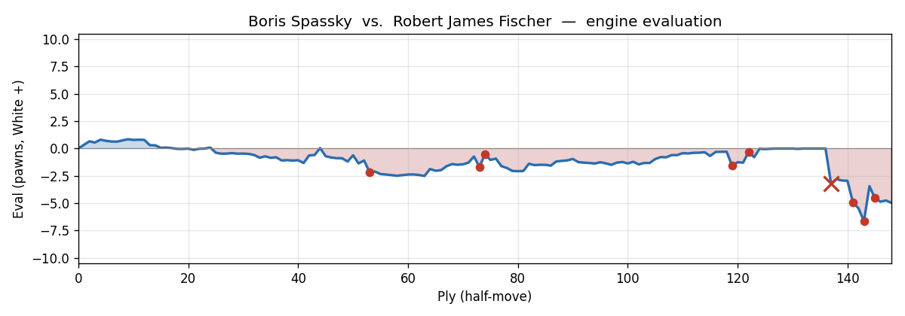

---

## Cold Open

It's 1972, Reykjavik, Iceland — the match the whole world has stopped to watch. Bobby Fischer, the Brooklyn prodigy who almost didn't show up, sits across from the reigning World Champion Boris Spassky. And in Game 13, Fischer deploys one of his favourite weapons — a provocative, hypermodern defence that dares White to overextend from the very first move.

Feel free to pause at any point and try to find what Fischer finds.

[SCENE BREAK]

## Move-by-Move Walkthrough

### The Opening — Alekhine's Defence, Modern Variation, Alburt Variation

**1. e4** — Spassky occupies the centre immediately. Principled, classical, exactly what you'd expect from the World Champion.

**1...Nf6** — And there it is. Fischer plays the Alekhine's Defence. Black is essentially saying: *attack my knight, push your pawns forward, and I'll dismantle that pawn chain from the inside.* It's a provocative, deeply principled choice — and very much a Fischer move.

**2. e5 Nd5 3. d4 d6 4. Nf3 g6** — Book moves through ply 8, all confirmed theory for the Alburt Variation of the Modern Alekhine. Spassky pushes his pawns forward; Fischer prepares to fianchetto his bishop and let it bear down on the extended pawn chain. **5. Bc4 Nb6 6. Bb3** — White develops the bishop, then retreats it immediately when Black's knight attacks. This is standard: the bishop keeps pressure on the d5 square without losing time to a permanent trade. **6...Bg7** — Fischer completes the fianchetto. The bishop on g7 stares straight down the long diagonal at White's extended centre.

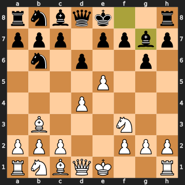


### 7. Nbd2

**7. Nbd2** is Spassky's first real decision point, and the engine isn't thrilled about it. The best move here was **7. a4** — pushing immediately to restrict Black's queenside knight before it can settle on c5 or threaten the bishop complex. The engine considers **a4** about half a pawn better, keeping spatial pressure on the queenside. **Nbd2** is natural-looking knight development, but it doesn't challenge Black's setup, and Fischer will soon demonstrate exactly the kind of flexible counterplay the Alekhine is designed to generate.

**7...O-O** — Fischer castles. Simple, safe, strong.

**8. h3 a5** — **8. h3** is a sensible prophylactic move, preventing a future ...Bg4 pin on the f3-knight. It has a real point: that bishop *could* come to g4, so the tempo isn't wasted. **8...a5** is Fischer immediately beginning queenside expansion, probing White's bishop complex on the b-file.

**9. a4** — Spassky plays **a4** a move late, but at least it's played. The position is roughly balanced.

### 9...dxe5

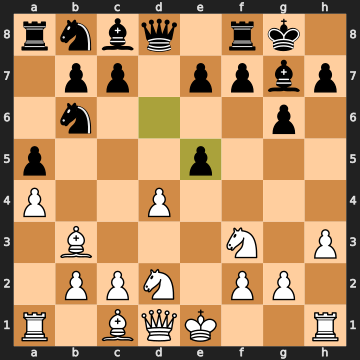


**9...dxe5** — Fischer opens the centre. The pawn trade creates slightly doubled pawns on Black's e-file — but far more importantly, it gives Black the kind of fluid, open position where the fianchettoed bishop on g7 comes alive. Material is level after **10. dxe5**.

**10...Na6** — Fischer retreats the knight to a6, intending to reroute it to c5, where it will hammer the b3-bishop. It's a long-distance plan, very typical Fischer: the knight looks awkward on the rim, but it knows exactly where it's going.

### 11. O-O

**11. O-O** — Spassky castles. This is fine — it's listed as essentially equal to the best alternative — but the engine slightly preferred **Qe2** first, keeping the rook on f1 potentially active and eyeing the e-file. Interestingly, the most passive piece in White's army right now is the bishop locked on c1, which hasn't contributed a single move and controls nothing. That's a problem Spassky doesn't fully solve.

**11...Nc5** — Here it is. The knight arrives on c5, attacking the bishop. Fischer's 10...Na6 manoeuvre is complete.

**12. Qe2 Qe8** — Spassky defends, and Fischer lifts his queen toward e6, beginning to put pressure on the advanced e5-pawn. The engine slightly preferred **12...Bf5** for Black, developing more directly, but **Qe8** is fine — Fischer is making his own plans.

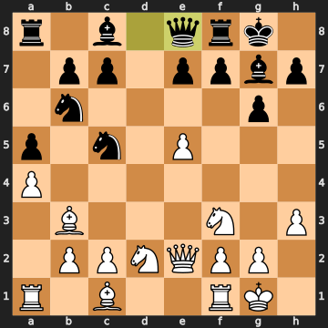


### 13. Ne4

**13. Ne4** — Spassky lunges forward, attacking Fischer's c5-knight. But this turns out to be an inaccuracy. The engine preferred **Rd1**, putting the rook on the open d-file and maintaining a small plus. **Ne4** loses roughly half a pawn in evaluation — not because it's obviously bad, but because it invites the sequence Fischer was waiting for.

**13...Nbxa4** — Fischer captures the a4-pawn. Now: the a4-pawn is defended by the bishop that just moved to b3, so let's walk through this carefully. Black takes the pawn with the b6-knight (**Nbxa4**). White recaptures: **14. Bxa4**, winning back a knight. But then **14...Nxa4** — Fischer takes the bishop. Net result: Black has given up one knight and taken one pawn plus one bishop. The material settles at White up roughly two pawns' worth — but the engine still gives Black a small edge because of piece activity and structural factors. Black is down a point materially but ahead positionally, which is very Alekhine territory.

### 14...Nxa4

**14...Nxa4** is the only real move here — anything else drops material catastrophically. The alternatives were horrible: **14...Qxa4** allows **Rxa4 Nxa4 Re1** and White consolidates up material. **14...Nd7** allows **e6** with a crushing central advance. Fischer takes the bishop — forced and correct.

**15. Re1 Nb6** — Spassky activates the f1-rook; Fischer retreats the knight to a safe square. **16. Bd2 a4** — Spassky develops the bishop (finally getting that c1 piece off the back rank, one move late); Fischer immediately advances the a-pawn, staking a queenside passed pawn.

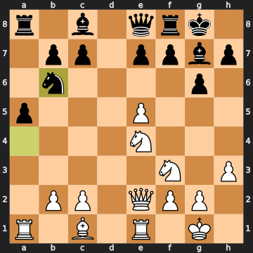


**17. Bg5 h6** — **17. Bg5** develops the bishop aggressively toward the kingside. The engine preferred **Bb4**, but this is playable. **17...h6** is Fischer kicking the bishop — and note that the bishop on h4 that follows will have only one safe retreat square (g3), making it a somewhat passive piece. **18. Bh4** — Spassky retreats rather than trade. Makes sense; he wants to keep the bishop active.

**18...Bf5** — Fischer develops with a direct attack on the e4-knight. The g7-bishop has been doing its fianchetto work; now the c8-bishop joins the party.

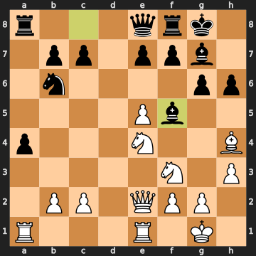


**19. g4** — Spassky drives the bishop away. This is aggressive but costs him pawn cover on his kingside. **19...Be6** — Fischer retreats. The engine confirms this is the best response.

**20. Nd4 Bc4** — Spassky centralises the knight, hitting Fischer's bishop on e6. Fischer slides to c4, now directly attacking the queen. **21. Qd2** — Spassky moves the queen off the attack. Notice this also vacates e2 as a retreat for the d4-knight, which a pawn push might otherwise threaten to trap.

### 21...Qd7

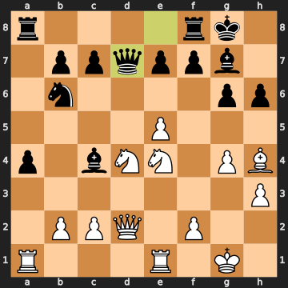


**21...Qd7** is listed as an inaccuracy — and it is. The engine's choice here was **21...Bxe5**, simply winning the e5-pawn! Let's see how it works: **...Bxe5** grabs the pawn; White's best reply is **Rad1**, and after **...a3 bxa3 Rxa3** Black keeps the pawn advantage and has real queenside counterplay. Instead, **Qd7** is more of a regrouping move, pointing the queen at the d4-knight, but it lets the e5-pawn breathe for a bit longer. The evaluation swings back toward equality. Not a catastrophe — but Fischer left a pawn on the table.

### 22...Rfe8

**22. Rad1** — Spassky correctly centralises the rook on the open d-file. **22...Rfe8** — Fischer connects the rooks, but the engine preferred **22...c5!** This is a concrete attacking move: **...c5** hits the d4-knight, and after **Nxc5 Qc7 Ne4 Rfd8**, Black keeps the initiative. The engine evaluates this as roughly 0.6 in Black's favour. **Rfe8** is a natural-looking development move but it nudges the position back to near-equality. Again — not a blunder, just a slightly slower path.

### 23. f4

**23. f4** — Spassky pushes the f-pawn, trying to expand on the kingside. The engine says this is actually an inaccuracy; the simple **b3** — attacking Fischer's a4-pawn — was better, holding the position near equality. **f4** overextends slightly and gives Fischer more targets. Note that this push does open f2 as a retreat for both the e4-knight and the h4-bishop, which is a real benefit — but the cost is the weakened kingside pawn structure.

**23...Bd5** — Fischer plants the bishop on d5, attacking the e4-knight. **24. Nc5** — Spassky attacks the d7-queen. **24...Qc8 25. Qc3** — Fischer sidesteps; Spassky regroups the queen. The engine preferred **25. e6** for White here, which would have been more ambitious, but **Qc3** is solid.

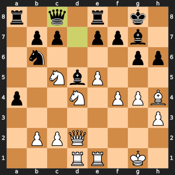


### 25...e6

**25...e6** is another slight inaccuracy from Fischer — the engine preferred **25...c6**, which held about a pawn advantage for Black. After **c6 Bf2 e6 Ra1 Bf8**, Black keeps queenside space and the bishop pair active. **e6** instead walks the bishop on d5 into a more passive configuration. Still, the position remains comfortably in Fischer's favour.

### 26. Kh2

**26. Kh2** — Spassky moves his king off the back rank. This looks like prophylaxis, maybe preparing for g5 later, but the engine says it's an inaccuracy. The best move was **26. Bf6!** — the bishop slices in, aiming to trade off the g7-bishop, which is a key defender of Fischer's position: **Bf6 Bxf6 exf6 Nc4 f5** and White reduces the deficit. Instead, **Kh2** allows Fischer to find a thematic regrouping.

### 26...Nd7

**26...Nd7** — Fischer moves the knight to d7, attacking the c5-knight. The flag here is "sound sacrifice," and while there's no material given up on this move itself, Fischer is engineering a larger piece sacrifice. The evaluation moves firmly in his favour. The knight on d7 eyes both c5 and e5; it's a redeployment that makes everything work.

### 27. Nd3

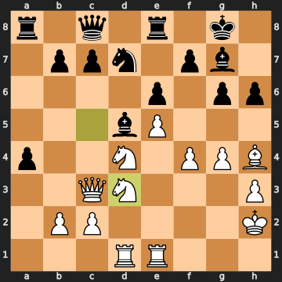


Here it is. *Feel free to pause and find the best move for White.*

**27. Nd3** — and this is a mistake. A significant one. The engine's best move was **27. Nxd7 Qxd7 28. Qd3 b5 29. Nxb5** — taking the knight on d7 immediately, trading pieces and keeping the position complicated. Instead, **Nd3** retreats the c5-knight passively to d3, losing two full pawns in evaluation. Spassky was probably nervous about the position after trading, worried about Black's queenside pawns and activity. But the passive retreat just gives Fischer everything.

**27...c5** — Fischer attacks the d4-knight. **28. Nb5** — Spassky jumps to b5. **28...Qc6** — Fischer attacks it directly. **29. Nd6** — Spassky plunges the knight to d6, attacking the e8-rook. It's a desperate bid to create complications.

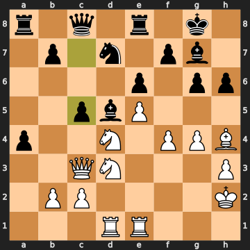


### 29...Qxd6

**29...Qxd6** — Fischer takes the knight. Now the material situation looks dramatic: Black has given up his queen for a knight, with material swinging to White materially on the surface. But watch what happens. **30. exd6** — White takes the queen.

### 30...Bxc3

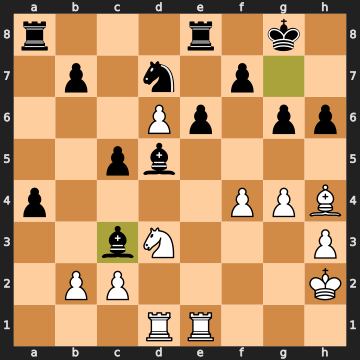


**30...Bxc3** — Fischer immediately takes the c3-queen with the bishop, also threatening the e1-rook. This is the only good move, and Fischer finds it instantly. Let's track the material: Fischer sacrificed his queen, got a knight; now he takes back the queen. After **31. bxc3** — White's only recapture — the position has settled. Black is down one pawn on the material count, but White now has *doubled pawns on the c-file* and a much worse pawn structure. The bishop sacrifice was perfectly timed: Fischer traded the queens off because White's queen was the only thing coordinating White's pieces, and now the position opens up for Black's bishops and passed pawns.

Note also: the engine shows that if Black had played anything else instead of **Bxc3** — moves like **...g5** or **...Bd4** — White would actually be winning comfortably. Fischer had to find this, and he did.

### 31. bxc3

**31. bxc3** — forced recapture. This gives White doubled c-pawns, which are genuinely weak — two pawns on the same file, neither supporting the other. Black may be down a pawn in raw count, but those doubled isolated pawns will haunt Spassky for the rest of the game.

**31...f6** — Fischer opens lines toward the d6-pawn. **32. g5** — Spassky pushes, trying to advance on the kingside.

### 32...hxg5

**32...hxg5** — Fischer captures, but the engine preferred **32...Bf3!** — an attacking move that keeps the bishop active and threatens to penetrate. **...hxg5** is still good, but it gives Black doubled g-pawns, which is slightly inelegant. The evaluation jumps back toward equality rather than keeping the full advantage. A minor slip — the position still favours Fischer, just by a bit less.

**33. fxg5 f5** — **33. fxg5** recaptures; **33...f5** closes the kingside somewhat, fixing the pawn structure. **34. Bg3 Kf7** — both sides manoeuvre. **35. Ne5+** — Spassky plays a fork!

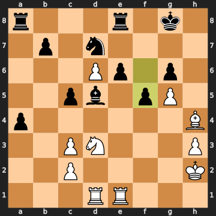


### 35. Ne5+

**35. Ne5+** — the knight on e5 attacks the king on f7 *and* the knight on d7 simultaneously. It's a genuine fork with check. Spassky gets something concrete. The engine confirms this is actually the best move for White, though the position is still better for Black.

### 35...Nxe5

**35...Nxe5** — Fischer takes the knight. This is the only good move. If the king retreats instead — **35...Kg7** or **35...Kg8** — White's knight takes the d7-knight with a fork, and Black's position falls apart. Fischer gives up the knight.

**36. Bxe5** — Spassky recaptures.

### 36...b5

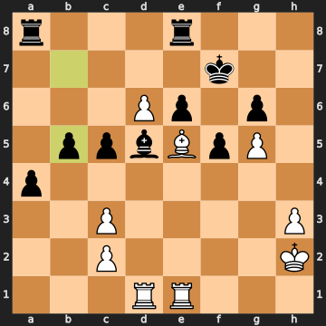


**36...b5** — Fischer advances the queenside pawn. The engine preferred **36...Red8**, which would keep the rook centralised and maintain a larger advantage (about 1.3 for Black). **...b5** is still playable but slightly reduces the advantage. It does open the b7 square as a retreat for the d5-bishop, which is a real structural benefit.

### 37. Rf1

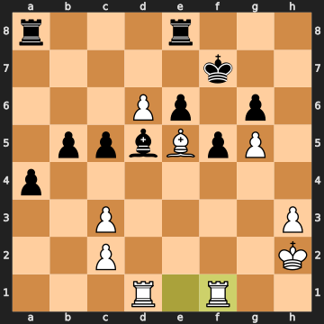


**37. Rf1** — and here Spassky misses something important.

*Pause here. What should White play instead?*

The engine says **37. c4** was the move. After **c4**, White attacks the d5-bishop and creates a passed pawn on the queenside — **c4** keeps White's drawing chances alive. By comparison, **Rf1** just repositions the rook passively with no direct purpose in the position, and it allows Fischer to manoeuvre aggressively. This is a mistake that costs Spassky nearly a pawn in evaluation.

### 37...Rh8

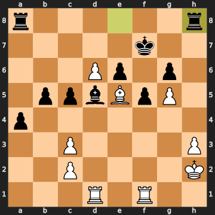


**37...Rh8** — and Fischer misses his chance too! The engine strongly preferred **37...Red8**, which would have kept the rook centralised and maintained a nearly decisive advantage of around 1.7 for Black. **Rh8** instead swings the rook to the h-file — an active idea, but the wrong rook activation at the wrong moment. The evaluation swings back toward rough equality as a result. This is the kind of decision that happens even at the world championship level: both players misread the position simultaneously.

### 38. Bf6

**38. Bf6** — Spassky moves the bishop to f6, attacking the h8-rook, but the engine says **38. Bxh8** was actually better: take the rook for free with **Bxh8 Rxh8 Rfe1**, and White consolidates. Instead **Bf6** passes up a material gain. Another missed opportunity.

**38...a3** — Fischer advances the passed a-pawn. This is correctly identified as good — the a-pawn will become a serious threat.

### 39. Rf4

**39. Rf4** — yet again, the engine prefers **Bxh8** first. Spassky keeps declining to win the h8-rook. Instead he activates the rook to f4, which is reasonable-looking but not the most accurate. The evaluation for Black continues to grow.

**39...a2** — Fischer advances the a-pawn to the penultimate square. This pawn is now one step from promotion. **40. c4** — Spassky attacks the d5-bishop. **40...Bxc4** — Fischer takes the pawn.

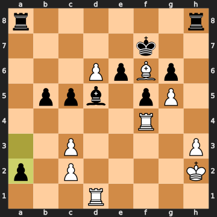


**41. d7** — Spassky advances his passed d6-pawn to d7, threatening to promote. This keeps the tension alive.

### 41...Bd5

**41...Bd5** — Fischer retreats the bishop. The engine preferred **41...e5** here: **e5 Bxe5 Rhd8 Bf6 Be2** and Black keeps a decisive advantage. **Bd5** is still good, but it slips a bit — the evaluation drops from around 2 to about 1.4 for Black. The position is still clearly better for Fischer, just not as cleanly winning.

**42. Kg3 Ra3+ 43. c3** — Spassky blocks the check. **43...Rha8** — Fischer doubles the rooks on the a-file. **44. Rh4** — Spassky activates the rook.

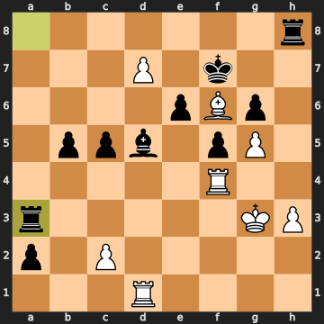


**44...e5** — Fischer pushes, opening the e6-square as a retreat for the d5-bishop and activating the centre. **45. Rh7+** — Spassky checks, driving Fischer's king.

### 45...Ke6

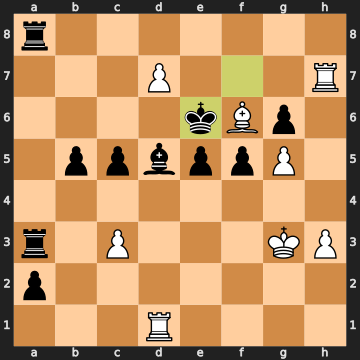


**45...Ke6** is the only good move here. The king steps to e6 — and notice: it now directly attacks the f6-bishop. If Spassky doesn't do something, Fischer threatens to win it. The engine confirms this is the best move.

### 46. Re7+

**46. Re7+** — Spassky checks again, forcing the king back. The engine says this is the best try, though it does slightly cost White. After **Re7+ Kd6 Rxe5**, Spassky wins back the e5-pawn — at least gaining something.

**46...Kd6** — forced, the only legal square. **47. Rxe5** — Spassky wins the pawn, attacking the d5-bishop. **47...Rxc3+** — Fischer checks! **48. Kf2 Rc2+** — Fischer continues to check, keeping the king off-balance.

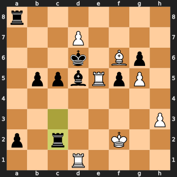


### 48...Rc2+

**48...Rc2+** is the only good move, and Fischer finds it. After **49. Ke1**, Fischer plays his key move:

### 49...Kxd7

**49...Kxd7** — Fischer captures the d7-pawn with his king! This looks strange — why would you walk into **50. Rexd5+**? But Fischer has calculated it. After **Rexd5+ Kc6 Rd6+ Kb7**, the king walks away from the checks, and Black keeps a winning extra pawn on the queenside. The engine confirms this is a sound sacrifice — the king takes the pawn and survives the check sequence. Fischer is down a pawn on the material count after the exchange, but the queenside passed pawns (a2, b5, c5) will be decisive.

**50. Rexd5+** — Spassky wins the bishop. **50...Kc6** — Fischer steps into the king chase.

### 50...Kc6

**50...Kc6** — the king moves to c6, attacking the d5-rook. The engine notes that **50...Ke8** or **50...Kc7** would actually be near-equal (the position could be drawn there), but **Kc6** keeps the winning try alive. Fischer marches toward his queenside pawns. The position remains favourably inclined for Black.

**51. Rd6+ Kb7 52. Rd7+ Ka6** — the king chase continues. Spassky keeps checking, trying to gain time. **53. R7d2** — Spassky finally stops the checks and targets Fischer's c2-rook. **53...Rxd2** — Fischer trades the rook. **54. Kxd2 b4** — Fischer advances another pawn.

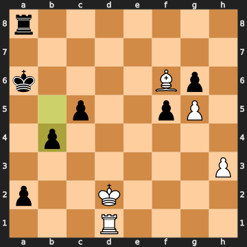


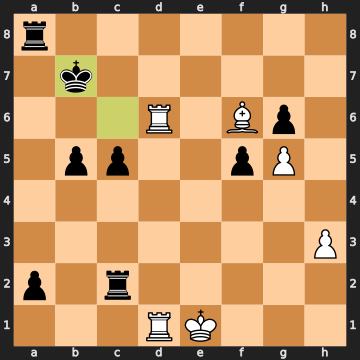


**55. h4 Kb5 56. h5 c4** — both sides advance. White pushes the h-pawn; Fischer pushes queenside pawns. **57. Ra1** — Spassky's best move, the only one that keeps drawing chances: the rook defends against the a2-pawn.

### 57. Ra1

**57. Ra1** is flagged as the only good move for White, and indeed the alternatives are immediately losing — **Ba1** allows **c3+** and White collapses. Spassky finds it. **57...gxh5** — Fischer captures the h5-pawn. **58. g6** — Spassky pushes the g-pawn toward promotion.

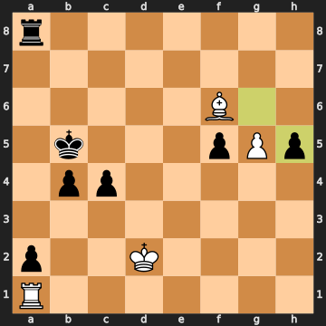


### 58...h4

**58...h4** — Fischer pushes the h-pawn. The engine says **58...f4** was marginally stronger (keeping it equal or slightly better), but **h4** is still good — the evaluation is near-balanced. This is a position where Fischer can win only with precision.

**59. g7 h3** — both pawns race. **60. Be7** — and here Spassky makes a crucial mistake.

### 60. Be7

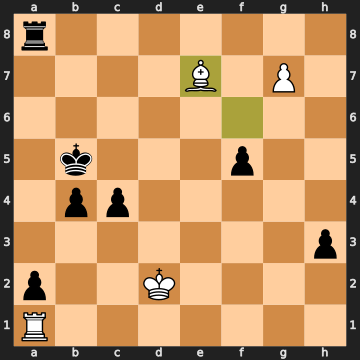


*Feel free to pause. What should White play here?*

The engine's answer is **60. Kc1** — the king rushes toward the queenside, heading to b2 to blockade the a2-pawn. That holds the drawing fortress: **Kc1 h2 Kb2 b3 Be5** and White can fight on. **60. Be7** instead sends the bishop on a detour and costs about 1.3 in evaluation. Spassky may have been focused on keeping the g7-pawn defended, but the critical task was stopping the a-pawn — and **Be7** doesn't do that.

### 60...Rg8

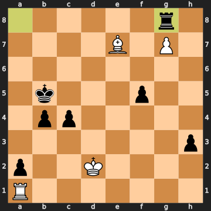


**60...Rg8** — Fischer attacks the g7-pawn. The engine says **60...h2** was stronger (perfectly equal) or **60...c3+** to immediately force the king back. **Rg8** is still good — it threatens to take the g-pawn — but it's not the sharpest. The evaluation swings back slightly toward Spassky. In a game this finely balanced, every move matters.

**61. Bf8** — Spassky defends the g7-pawn with the bishop.

### 61...h2

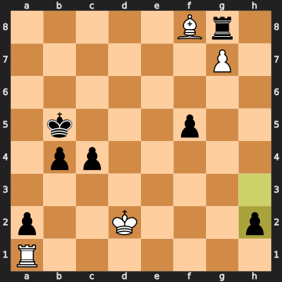


**61...h2** — Fischer pushes the h-pawn. But the engine says **c3+** was much better here — a pawn check that forced the king backward: **c3+ Kd3 h2 Rf1 f4** and Black keeps a clear winning advantage of about 1.3. After **61...h2** instead, the position nearly equalises. White can approach the h2-pawn and fight on.

### 62. Kc2

**62. Kc2** — the engine says this is an inaccuracy; **Rf1** was better, heading for the h-file to stop the h-pawn and fight the f5-pawn. After **Kc2 b3+ Kb2 f4 Rd1**, the position is balanced on a knife's edge.

### 62...Kc6

**62...Kc6** — Fischer activates the king toward the queenside. The engine flags this as an inaccuracy — **62...Kb6** or **62...f4** were better, keeping the winning margin. After **Kc6**, the position is almost equal again.

**63. Rd1 b3+ 64. Kc3** — Spassky steps to c3.

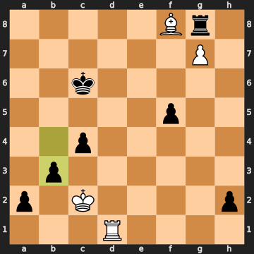


### 64...h1=Q

**64...h1=Q** — the h-pawn promotes! Fischer makes a new queen. This is a concrete moment — the evaluation has been hovering near equality, and now Fischer queens... but it's immediately captured. **65. Rxh1** — Spassky takes the queen.

### 65. Rxh1

**65. Rxh1** — Spassky captures the queen. The alternatives were catastrophic: **Kd2** gets mated in a forced sequence, and **Rd6+** allows checkmate in 9. **Rxh1** is the only move.

### 65...Kd5

**65...Kd5** — Fischer centralises the king immediately after the queens come off. The position is technically equal by the engine, but Fischer keeps fighting.

**66. Kb2 f4 67. Rd1+** — Spassky checks. **67...Ke4** — Fischer steps forward. **68. Rc1 Kd3** — the king marches toward the queenside pawns.

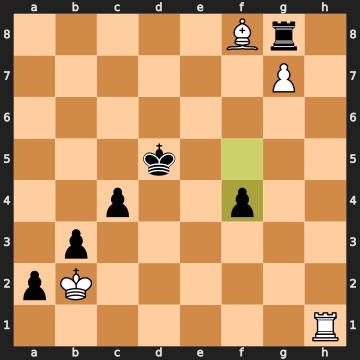


### 69. Rd1+

*Here is where Spassky breaks.*

**69. Rd1+** — this is the blunder that ends the game. The engine gives **69. Rc3+** as the only move that holds: **Rc3+ Ke2 Rxc4 f3 Re4+** and White can keep fighting. **Rd1+** instead drives the king exactly where it wants to go. After **69...Ke2**, the king steps *toward* the d1-rook, threatening to take it — and White has no good answer.

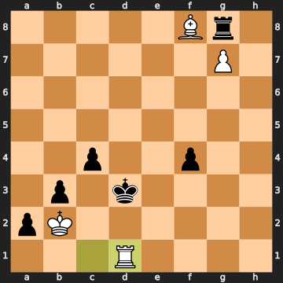


### 69...Ke2

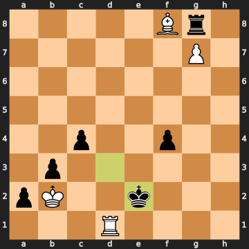


**69...Ke2** — Fischer's king steps to e2, attacking the rook and the c4-pawn simultaneously. The engine says **69...Ke3** was even better (nearly equal again), and **69...Ke4** holds equality precisely. But **Ke2** — the engine's flag as inaccuracy — is still winning by about 2.8 pawns. The position has finally tipped decisively.

**70. Rc1** — Spassky moves the rook. **70...f3** — Fischer advances.

### 70...f3

**70...f3** — the only good move, and Fischer plays it. The pawns on a2, b3, c4, and f3 form a coordinated wave that White simply cannot stop with one bishop and one rook. Note that **70...a1=R** or **70...a1=Q** would actually trade off the advantage back to equality — Fischer correctly avoids promoting prematurely.

### 71. Bc5

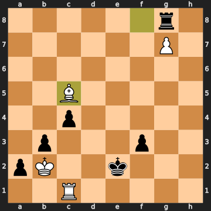


**71. Bc5** — and another mistake from Spassky, likely the decisive one. The engine says **Rxc4** was necessary: **Rxc4 f2 Re4+ Kf3 Rb4**, at least winning a pawn and keeping fighting. **Bc5** instead tries to reposition the bishop, but it accomplishes nothing — Fischer's pawns are just too dangerous. The evaluation drops to nearly -5.

**71...Rxg7** — Fischer takes the g7-pawn. The last of Spassky's passed pawns is gone. Black is clearly winning.

### 72. Rxc4

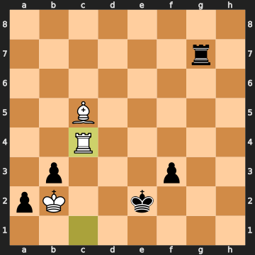


**72. Rxc4** — Spassky finally takes the c4-pawn. **72...Rd7** — Fischer centralises the rook on d7. The engine preferred **72...f2** for Fischer — pushing the f-pawn immediately to gain the maximum advantage — but **Rd7** is still winning. It's a "still decisively winning" position, so Fischer's move, while not the fastest path, doesn't change the outcome.

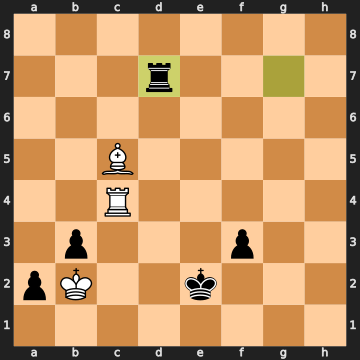


**73. Re4+** — Spassky checks. **73...Kf1** — Fischer steps the king forward.

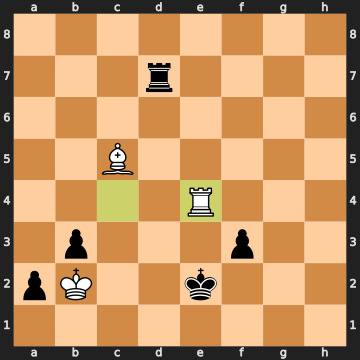


### 73...Kf1

**73...Kf1** is the only good move — the king marches toward the f-pawn. The alternatives (**73...Kd1** or **73...Kd2**) would have let Spassky back into the game. Fischer finds the right king path.

**74. Bd4 f2** — Fischer advances the f-pawn to f2. The position is completely winning for Black — the f2-pawn is about to queen, Spassky has no way to stop it without losing more material, and the evaluation has reached nearly -5.

Spassky resigns.

[SCENE BREAK]

## Outro

Bobby Fischer took everything the Alekhine's Defence promises — the knight provocations, the flexible counterplay, the patient undermining of an overextended centre — and turned it into a masterclass. Spassky played solidly in the opening, but the twin mistakes of **27. Nd3** (retreating passively instead of trading with **Nxd7**) and **60. Be7** (missing the king march **Kc1** that holds the draw) allowed Fischer's queenside pawn mass to become unstoppable.

As Ben Finegold might put it: *when you don't know what to do, improve your worst piece* — and in this game, Fischer always knew exactly which piece needed improving, while Spassky's bishops kept arriving one move too late, defending squares that were already gone.
