# redwood1978 vs. JamesTortoise — Let\\'s Play! (2025.10.05)

- **White:** redwood1978
- **Black:** JamesTortoise
- **Result:** 0-1
- **ECO:** A00
- **TimeControl:** 1/259200
- **White ELO:** 349
- **Black ELO:** 1038

## Moves (for reference)

```
1. e3 Nf6 2. Bd3 Nc6 3. Nf3 b6 4. O-O Bb7 5. Nc3 g6 6. b3 Bg7 7. Bb5
a6 8. Bc4 O-O 9. Ng5 Ne5 10. d4 Nxc4 11. bxc4 h6 12. Nge4 Nxe4 13. Ne2
c5 14. Ba3 cxd4 15. exd4 Rc8 16. Qd3 Rc7 17. Rab1 Rc8 18. f3 Ng5 19.
c5 b5 20. Nf4 Kh7 21. Rbe1 e6 22. Re5 Bxe5 23. Nxg6 fxg6 24. Re1 Bg7
25. c6 Rxc6 26. Re5 Rf7 27. Qe4 Nxe4 28. fxe4 Rxc2 29. Bc5 Rxa2 30. d5
Ra1# 0-1
```


## Evaluation across the game

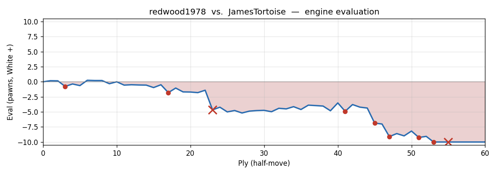

---

## Opening Narrative

Welcome, and thank you for sitting down with me for this one — because this is a special kind of game to look back on. Your son challenged you across the board, and what followed was thirty moves of genuine chess: a few twists, a few moments where the game hung in the balance, and a finish that was as clean as they come. You're playing White, and he's playing Black, and if you'll give me a few minutes I'll walk you through the whole thing together.

You opened quietly — not with the most aggressive first move, but a perfectly reasonable one. Your son replied by bringing his knight into the game straight away, and from there the pieces began to find their squares. The opening has a name — the Van't Kruijs Opening — but don't worry about that. What matters is the character of what followed: a slow, manoeuvring game where both sides took their time building up, and where the decisive moment came not in a blaze of sacrifices but in a single, costly misjudgement in the middlegame that your son converted with confidence.

## Move-by-Move Walkthrough

**1. e3** — You push a pawn forward one square, opening a diagonal for your bishop. A quiet, solid start. **1...Nf6** — your son brings his knight out immediately, pointing it toward the centre. A sharp, active response.

### 2. Bd3

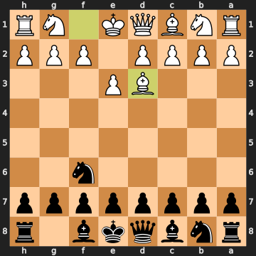


Now this is where things get a little tricky right away. You develop your bishop to a big, central square — it looks natural, and it feels like you're building something. But there's a problem: the bishop is sitting in front of the pawn that would normally go to the square right in front of it. That pawn — the one two squares in front of where the bishop started — is blocked in. It can't advance to help control the centre, and the bishop itself, while it looks impressive, doesn't actually have many good squares to go to next.

The engine would have preferred pushing that central pawn forward immediately — two squares — to stake out space and challenge your son for control of the middle of the board. That would have kept your options much more open. As it stands, the bishop's placement on move two has already slightly tangled your own position, and your son has a small but real advantage heading into the opening.

### 2...Nc6

Your son brings out his other knight — solid, natural development. The engine actually liked pushing his king's pawn forward instead, staking a claim in the centre more directly. **2...Nc6** is still a fine move, just a touch slower than seizing the initiative with a central pawn push. We're still very much in the opening skirmishes here.

**3. Nf3** — You bring your knight out to a strong central square, developing sensibly. **3...b6** — and here your son makes a small misstep. He pushes a pawn on the side of the board rather than planting one in the centre. The engine wanted to see the king's pawn pushed forward two squares — that would have given Black a strong grip on the middle of the board and kept your position under real pressure. Instead, **3...b6** — which is preparing to develop the bishop to the long diagonal — lets you off the hook somewhat. The eval actually swings back in your favour briefly.

### 3...b6

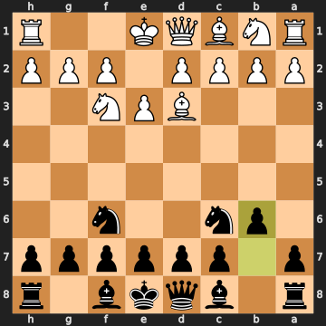


To be fair, this isn't a terrible move — it's part of a recognisable idea where Black develops the bishop to a long diagonal. But in this position, right now, it gives you a moment to breathe and catch up. Don't think of it as a blunder; think of it as your son being slightly too patient when he could have pressed harder.

**4. O-O** — You castle, tucking your king away to safety. Excellent practical decision. **4...Bb7** — your son follows through with his plan, sliding the bishop down to the long diagonal where it eyes the centre from afar. Both moves are fine.

### 5. Nc3

You develop your other knight — natural, bringing another piece into the game. But the engine points out that there was a slightly better square available: moving the bishop back to a safe central square would have been more harmonious. As it stands, the knight on this square can sometimes get in the way of your own plans. It's a minor point, though — not a real mistake, just a slightly suboptimal choice.

### 5...g6

Your son pushes a pawn to prepare for his bishop to slide out to the long diagonal on the other side — a very natural "fianchetto" setup. Not quite the most challenging move (the engine preferred other options), but it all fits his plan. At this point the position is essentially level.

### 6. b3

You push a pawn on the side, making space for your own bishop on the long diagonal — mirroring what your son is doing, in a sense. Again, a reasonable human instinct, but the engine would have preferred pushing your central pawn forward aggressively right now. That pawn push would have seized space in the middle and started to challenge your son's position. By choosing the slower move, you give him more time to complete his development comfortably. The advantage drifts slightly toward Black.

**6...Bg7** — your son finishes his fianchetto, placing the bishop on the long diagonal. A good move — exactly the best one available.

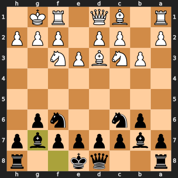


**7. Bb5** — You develop your bishop, pointing it at your son's knight. A natural move. **7...a6** — he nudges your bishop with a pawn, asking it to move. A confident reply.

### 8. Bc4

You retreat your bishop to a new diagonal. But the engine flags this as a missed opportunity: the stronger move was to simply *take* your son's knight right there. After that exchange, Black recaptures with his bishop, and then you develop your own bishop quietly to a safe square and continue. Why was capturing better? Because when you move away instead, you let your son's knight stay on its good square, and the bishop you've moved to its new home will soon find itself out of the game. The bishop on the new square is about to become a problem — as we'll see very shortly.

### 8...O-O

Your son castles, which is safe and sensible. But the engine actually preferred him to push his centre pawn forward two squares right now — that would have been more energetic, starting to challenge your position immediately. Castling first isn't bad, though; your son is keeping his king safe while he figures out his next step.

### 9. Ng5

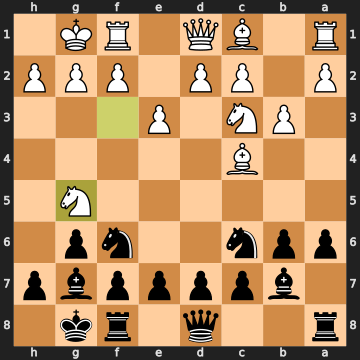


And here's the first real turning point. You leap your knight forward, deep into the middle of the board — an ambitious, aggressive move. But there's a real problem: that knight is heading somewhere your son can deal with quite easily, and more importantly, it means the knight has left the important central square it was controlling. The engine would have preferred simply pushing the centre pawn forward — two squares — which would have started to build a proper central presence and kept your position solid.

The knight on its new square looks threatening, but your son's pieces are well-placed enough to handle it. And critically, that bishop you've had on the new diagonal since move 8 is now sitting there unprotected — which is exactly what your son notices.

### 9...Ne5

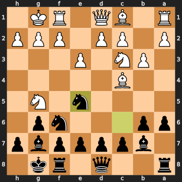


Your son spots that the bishop is now attacked by his knight. He brings his knight forward, threatening to take it. Not the very strongest move available — pushing the centre pawn immediately would have been even more forceful — but a very practical, human choice. "You're attacking me? Fine, I'll attack you back." The position is now clearly in his favour.

### 10. d4

You push a pawn to challenge his knight and try to gain central space. This attacks the knight that's sitting in front of your pawns. However, the engine preferred pulling your bishop back to safety first. By pushing the pawn, you give your son an immediate opportunity.

**10...Nxc4** — your son takes the bishop. The right move. He's won a piece — specifically, your bishop on the diagonal — in exchange for nothing at all.

### 11. bxc4

You take his knight back. This is the forced recapture, and really the only sensible response. The pawns on that side of the board are now doubled — two of your pawns are stacked on top of each other on the same column — which is a small structural weakness, but the real issue is that you've already given up the bishop and received a knight in return, and your son came out ahead in that deal. Your son is up roughly a bishop's worth of material — think of it as being about three points ahead.

### 11...h6

Your son nudges your knight, pushing it away from its advanced position. A reasonable move — but the engine points out that he could have been more ambitious here. Pushing his centre pawn forward would have kept the pressure on while your position was still a little disorganised. **11...h6** is fine — it removes the knight from a threatening square — but it's a touch slower than the sharpest continuation.

### 12. Nge4

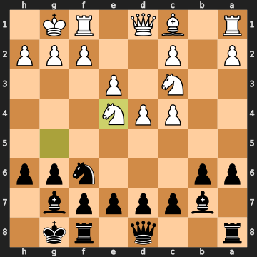


And here is the decisive mistake of the game. You move your knight forward to attack your son's knight — it looks active, it looks aggressive, maybe even a little intimidating. But the problem is that this knight has just walked into danger. Your son's knight, sitting on the good central square, can simply capture this new knight — and when your other knight comes back to recapture, your son will take *that* one too, leaving him up another full piece.

The engine says the right move was to simply retreat the first knight — to a safe square where it could continue to participate. That would have limited the damage. Instead, the knight on move 12 walks straight into a capture, and now your son is about to be up a *knight* — that's three points — with no compensation. This is the move where the game effectively turns irrecoverable.

**12...Nxe4** — your son takes the knight immediately. Exactly right. He now attacks your remaining knight as well.

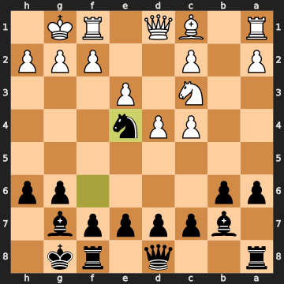


### 13. Ne2

You sidestep, moving the other knight out of the attack. The engine wanted you to recapture — trading knight for knight — which would have at least recovered some of the material and simplified the position. By moving instead of recapturing, you fall further behind. Your son is now up a full knight's worth of material with no compensation in sight.

**13...c5** — your son advances a pawn in the centre, staking space and keeping your position under pressure. A solid, sensible move.

### 14. Ba3

You bring your bishop out to a new diagonal — it's pointed at your son's rook on the far side of the board. The engine would have preferred activating your rook on the other side of the board, getting it into the game. The bishop move isn't terrible, but with your position already under strain, getting your pieces working together was the priority.

**14...cxd4** — your son captures a central pawn. A good move — it also opens up a retreat square for his knight if it ever needs one. He captures a pawn and makes a slight structural trade (creating doubled pawns of his own in the process), but the practical benefits outweigh that.

**15. exd4 Rc8** — you recapture the pawn, and your son swings his rook to the open file. Both moves are natural and sensible.

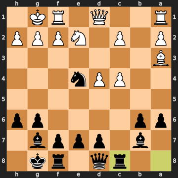


**16. Qd3** — you bring your queen into the game, targeting your son's knight. **16...Rc7** — he slides his rook sideways. **17. Rab1** — you activate your rook on the side of the board. **17...Rc8** — your son shuffles his rook back.

### 18. f3

You push a pawn to challenge your son's well-placed knight, trying to drive it away from its commanding central square. An understandable idea — that knight has been sitting there dominating the board for several moves. But the engine points out that there were more active options, like pushing your central pawn forward aggressively. The position at this point has your son clearly ahead, and the pawn push doesn't really change the fundamental picture.

**18...Ng5** — your son moves his knight away from the attacked square, sending it to a new outpost. Still clearly winning.

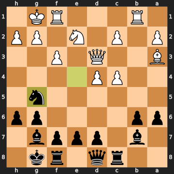


**19. c5** — you advance a pawn, trying to create some activity on the queenside. **19...b5** — your son challenges it immediately.

### 20. Nf4

You bring your knight to a new square, looking to play actively. The engine preferred pushing your central pawn forward to create more complications. Your son, meanwhile, plays **20...Kh7** — just moving his king one step to the side, making a small safety precaution. Not the sharpest move, but still clearly winning.

### 21. Rbe1

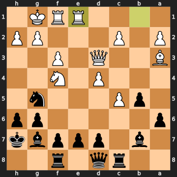


You move your rook towards the centre, preparing to add pressure. But here the engine pinpoints something important: your son's knight on its current square has only one safe square it can retreat to. Pushing a pawn to attack it *right now* — before it could find safety — would have been the strongest practical try to complicate things. By choosing a different move, you give that knight the time to shuffle to safety.

**21...e6** — your son opens a little space and secures his position. Still clearly ahead.

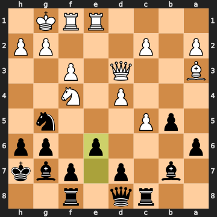


### 22. Re5

You move your rook forward, attacking your son's knight directly. The engine actually preferred pushing a pawn to attack the knight — that would have been stronger because the pawn advance would have left the knight with *no* safe retreat at all, essentially trapping it. The rook move is active, but it gives your son a cleaner answer.

**22...Bxe5** — your son takes the rook immediately, giving up his powerful bishop in exchange for your rook. Now your other knight attacks the bishop as well, so this is a genuine exchange — but your son is still well ahead overall in terms of the material balance.

### 23. Nxg6

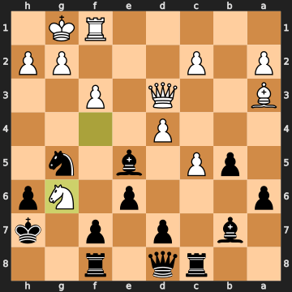


Here you spring what looks like a clever combination: you take his pawn with the knight, and the knight simultaneously attacks his rook AND his bishop — a double attack, threatening to win one of them back. It's an imaginative idea, and you spotted a real tactical feature of the position. The problem is that your son doesn't have to fall apart here. The engine says the right move was actually to take the bishop right back — recapturing what he just took — which would have held things together much better. Instead, the knight leap, while exciting, ultimately doesn't recover enough material to stay in the game.

**23...fxg6** — your son calmly takes the knight back, and now his pawn on that square actually gives his other knight a potential escape route. Your attack doesn't find a knockout.

### 24. Re1

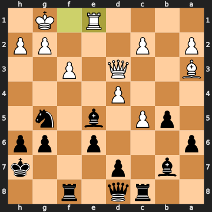


You bring your rook back toward the bishop that's sitting in the middle of the board. But the engine says you should have taken that bishop immediately — recapturing what you were owed. By hesitating, you give your son more time to consolidate his enormous material advantage. He's now up very significantly — roughly the equivalent of two full rooks ahead.

**24...Bg7** — your son pulls his bishop back to safety. A calm, sensible retreating move.

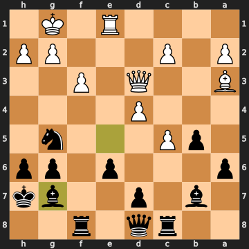


### 25. c6

You push a pawn forward, attacking your son's bishop on the side of the board. The pawn is now a passed pawn — it has no enemy pawns blocking its path — and that's a genuine asset. This is actually one of the better moves available in a very difficult situation.

### 25...Rxc6

Your son sacrifices his rook — deliberately giving it up — to eliminate your advanced pawn. This is a sound sacrifice: yes, he's giving up the rook, but your pawn had gotten quite far and was potentially going to cause problems. By removing it, your son keeps his position clean and his overwhelming material advantage intact. He saw that eliminating that pawn was worth the rook because the resulting position, with his queen and multiple pieces active, is completely winning anyway. Credit where it's due — your son calmly calculated that this was the right way to proceed, not panicking at the advanced pawn but simply removing it.

### 26. Re5

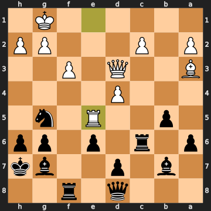


You move your rook to attack his knight. But the engine preferred a different approach: capturing his rook first with your bishop, which would have at least grabbed a piece back and simplified in a slightly better way for you. The rook move doesn't create the same concrete recovery.

**26...Rf7** — your son slides his rook to a safe square.

### 27. Qe4

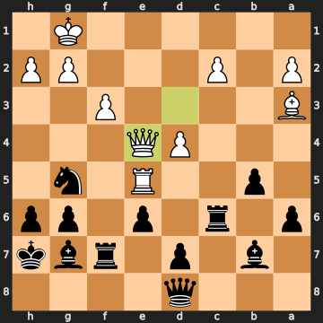


You bring the queen forward, attacking your son's rook. But this is a step too far — the queen is now exposed, and your son spots the opportunity immediately.

**27...Nxe4** — your son takes the queen. He's now won the queen for a knight, an enormous material gain, and the game is essentially over.

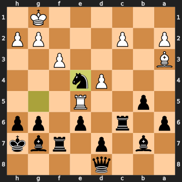


### 28. fxe4

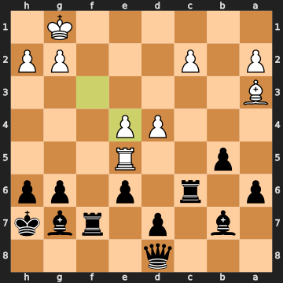


You recapture the knight with your pawn. The position has now completely simplified, and your son has a decisive advantage — we're looking at a forced checkmate within just a few moves according to the engine.

**28...Rxc2** — your son takes a pawn with his rook, collecting material while weaving the mating net.

### 29. Bc5

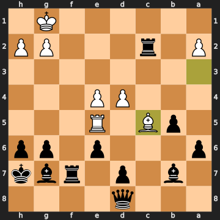


You move your bishop. With so little material left on your side, there's nothing that genuinely stops what's coming. The engine notes that your bishop and rook are both under pressure, and the pawn that's defending them is overworked — it can't save both pieces at once. This is the point of no return, and all roads lead to the same destination.

**29...Rxa2** — your son takes another pawn with his rook, the position wide open.

### 30. d5

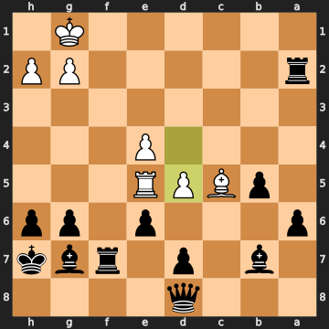


You push a pawn forward — one last move to try and create some counterplay, perhaps hoping to queen that pawn. But the rooks have found their way in.

### 30...Ra1#

And there it is. Your son slides the rook all the way to the back rank. Your king has nowhere to go — the rook covers the entire row, and there's no piece available to block or capture. Checkmate. A clean, decisive finish.

## Closing Reflection

This was a game decided by a single critical moment: move 12, when the knight marched forward into a square where it could simply be taken, costing you a piece you couldn't afford to give up. Up until that moment, the game was genuinely competitive — a bit uneven, yes, with your son holding a small advantage, but nothing close to decided. The knight on move 12 changed everything.

To his credit, your son played calmly and confidently once he was ahead. He didn't panic at the double attack on move 23 or at the advanced pawn on move 25 — he found the right answers and converted methodically. The finish — that rook sliding all the way to the back rank for checkmate — was a nice, clean conclusion to a well-played second half for Black.

For you, the key lesson is the one in the middlegame: when things look complicated, it's worth pausing and asking "is my piece safe on that square?" before leaping forward. Your instincts throughout — castling early, developing your pieces, looking for active moves — were all sound. The game turned on one big decision, not on thirty small ones. And frankly, sitting down with your son for thirty moves of proper chess is worth more than any result. Well played to you both.

---

## Other key positions

**30... Ra1#** (best)

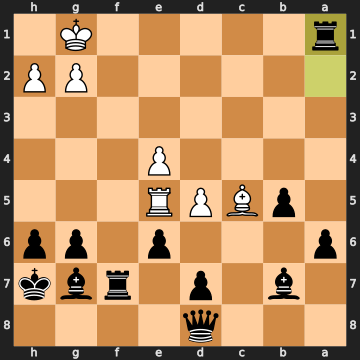

