# redwood1978 vs. JamesTortoise — Let\\'s Play! (2026.03.30)

- **White:** redwood1978
- **Black:** JamesTortoise
- **Result:** 0-1
- **ECO:** A00
- **TimeControl:** 1/259200
- **White ELO:** 524
- **Black ELO:** 1064

## Moves (for reference)

```
1. d3 Nc6 2. Be3 d5 3. Nc3 e5 4. Nf3 Bg4 5. h3 Bh5 6. Bg5 Nf6 7. g4
Bg6 8. h4 Nxg4 9. Bxd8 Rxd8 10. Ng5 Be7 11. Nxd5 Rxd5 12. e4 Rb5 13.
b3 O-O 14. c4 Bb4+ 15. Ke2 Nd4# 0-1
```


## Evaluation across the game

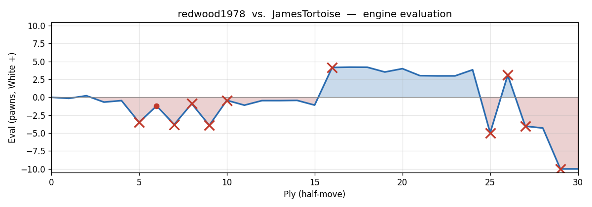

---

## Opening: A Slow Start Turns Sharp

Welcome to what, on paper, looks like a perfectly quiet Sunday afternoon game — a correspondence match between redwood1978 (White, rated 524) and JamesTortoise (Black, rated 1064). The time control is correspondence pace, which means both players had plenty of time to think. White opens with **1. d3** — the Mieses Opening, a gentle, unassuming first step that keeps things flexible. No grand ambitions, no immediate confrontation. Just a pawn sliding forward one square to take a look around.

And yet, within fifteen moves, White's king is getting mated on the second rank. That's chess for you.

Fair warning, redwood: this is going to be an honest look at what happened. Not a lecture, just a friendly commentator walking through the game with you and pointing out the moments where things went sideways — and why. There are some real lessons hiding in here, and a couple of moments where the game could have gone very differently.

## Move-by-Move Walkthrough

### 1. d3

Right, so **1. d3** — the Mieses Opening. White holds back, keeps the bishop on f1 temporarily locked in, and plans to build slowly. It's not the sharpest way to begin, and the engine would rather see **1. e4** (claiming central space right away), but there's nothing wrong with it at this level. A lot of players feel comfortable starting quietly. The small downside is that d3 blocks the natural development of the dark-squared bishop and slightly softens White's grip on the centre before it's even been established. The eval nudges slightly to Black's favour, but we're talking fractions — this is still a perfectly playable game.

### 1...Nc6

Black responds with **1...Nc6**, developing the knight toward the centre. The engine mildly prefers **1...d5**, striking the centre immediately, but **Nc6** is a fine developing move. No complaints here — pieces off the back rank is always reasonable.

### 2. Be3

Now this is where things get a little unusual. White plays **2. Be3**, developing the dark-squared bishop before completing any central pawn development. The engine's clear preference is **2. d4** — push the other pawn and actually contest the centre. The problem with **Be3** this early is that the bishop has ventured out to an active square, but there's nothing much to do there yet. More critically, it's going to become a target very soon, as we'll see. The eval swings to around -0.67, meaning Black now has a comfortable edge.

**2...d5** — Black takes the centre. Good.

### 3. Nc3

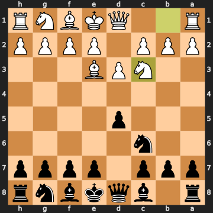


And here we hit our first big problem. **3. Nc3** looks natural — develop a knight, support the centre — but look at the board. White has a knight on c3 and a bishop on e3. And Black has a pawn on d5. Can you see what's coming?

Black can play **...d4** — a pawn fork — hitting the knight on c3 AND the bishop on e3 simultaneously. That one pawn threatens to win a piece for free, because White can only move one of those attacked pieces at a time. The right move here was **3. d4** — simply pushing the pawn to block that fork possibility and contest the centre properly. Instead, White has handed Black a free piece if Black finds **...d4**. The eval collapses to -3.49. That's a full piece of advantage for Black — a significant gift.

### 3...e5

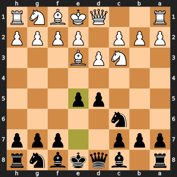


Here's the twist, and it's a big one. Black plays **3...e5**, pushing the e-pawn to the centre. This is a perfectly natural, human move — occupying the centre, fighting for space. But Black just walked past the winning move: **3...d4**, the pawn fork. After **3...d4 4. Bxd4 Qxd4** — oops, that's not right, let's walk it through. After **3...d4**, the knight on c3 and bishop on e3 are both hit. White has to move one. Say **4. Bd2** (retreating the bishop) — Black has won the centre AND kept the pawn. Or if White tries **4. Bxd4**, then **4...Qxd4** forks the bishop and threatens the knight. Either way, Black comes out ahead with either a pawn or a piece. It's the kind of opportunity that's easy to miss when you're in "build-my-position" mode rather than "look-for-tactics" mode. The game continues, but with things roughly equal again around -1.20.

### 4. Nf3

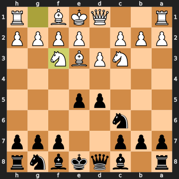


White develops the knight to f3 — sensible in a vacuum, but look again at that fork vulnerability. The knight on c3 and bishop on e3 are STILL both hanging to **...d4**. In fact, White just added another piece to the board while the existing problem on c3/e3 remains completely unaddressed. The engine says **4. Bd2** was the move — immediately retreating the bishop and eliminating the fork target. **4. Nf3** keeps the position looking tidy on the surface while the ticking bomb on d4 is still there. Eval pushes further against White, to about -3.80.

### 4...Bg4

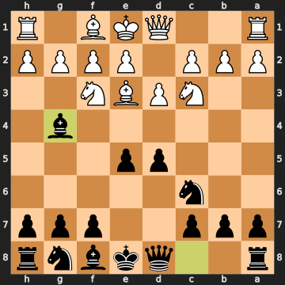


And Black misses the fork again! **4...d4** was still winning here — after the fork, Black would've come out a piece up. Instead, Black plays **4...Bg4**, pinning the knight on f3 against the queen. It's an attacking move that makes intuitive sense — hit that knight, create pressure — but it lets White off the hook entirely. The eval bounces back to -0.89 — from a potentially winning position for Black down to a modest edge. **4...Bg4** does attack the f3 knight, which is real pressure, but it's not nearly as strong as just collecting a free piece with **...d4**. The lesson: before developing your next piece, always ask "can I win something right now?" Sometimes the best move on the board isn't the most developing-looking one.

### 5. h3

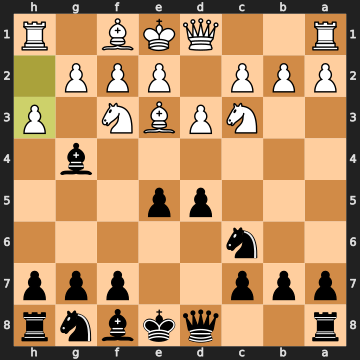


**5. h3** — White kicks the bishop. There's genuine logic here: the bishop on g4 is pinning the knight on f3 against the queen, and h3 asks it to declare its intentions. The move also opens h2 as a potential retreat square for the f3 knight. However — and this is crucial — the engine points out that **5. d4** was still the correct and most important move, because the fork vulnerability (c3 and e3) is STILL sitting there like an undefused grenade. Every move White plays that isn't **d4** is another chance for Black to play **...d4** and win material. The eval stays badly negative for White.

### 5...Bh5

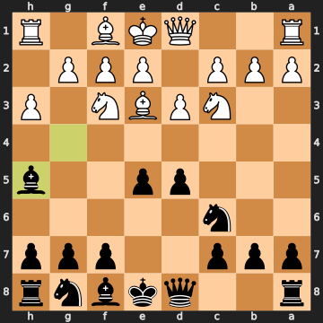


Black retreats to **5...Bh5**, keeping the pin on the f3 knight. Again, this is the natural human continuation — keep the pressure, stay on the f3 knight. But again, **5...Bxf3** was better: take the knight, double White's pawns after **gxf3**, and then play **...d4** to pick up the bishop on e3 as well. That sequence would've been genuinely devastating. The engine says the eval after **5...Bxf3 gxf3 d4** was around -3.91 for White — a winning advantage for Black. Instead, **5...Bh5** resets back to roughly equal play (-0.42). Two chances to win a piece with **...d4**; two times missed.

### 6. Bg5

**6. Bg5** — White develops the other bishop, pinning Black's knight on f6 (well, there isn't a knight on f6 yet, but it attacks the queen on d8). The engine actually preferred **6. g4** here — an aggressive push to kick the h5 bishop right now, while the bishop on h5 has only one safe retreat square (g6). That window of opportunity was actually the best move. **6. Bg5** is still reasonable, attacking the queen, but it's a slight inaccuracy that lets the bishop on h5 settle comfortably.

### 6...Nf6

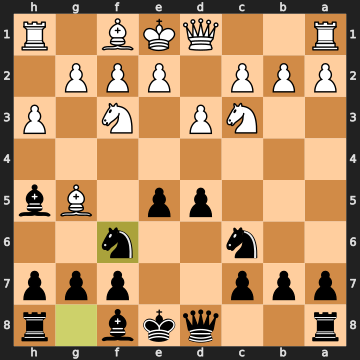


Black plays **6...Nf6**, developing the kingside knight and defending against the Bg5 pressure on the queen. The engine preferred **6...f6** to immediately expel the g5 bishop. **6...Nf6** is natural and fine — no major harm done, just a slight missed opportunity to drive the bishop away on more favorable terms.

**7. g4** — The engine says this is actually the best move here, and it is: White attacks the h5 bishop and it has only one safe square, g6. Good instinct. **7...Bg6** — forced and correct, the bishop retreats to g6.

### 8. h4

White plays **8. h4**, continuing the pawn advance to chase the bishop further. Here's the remarkable thing: the bishop on g6 now has NO safe retreat square at all. If White continues with **h5**, the bishop is completely trapped. The engine preferred **8. e3** here — a quiet developing move that would solidify the position and connect the rooks eventually. But there's a human logic to **8. h4**: keep pushing, trap the bishop! The problem is that trapping the bishop takes another move (**h5**), and in the meantime, Black can cause chaos. The eval is about -1.09, a modest Black advantage.

### 8...Nxg4

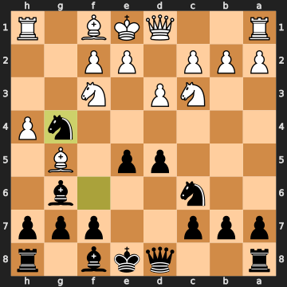


Oh, interesting. **8...Nxg4** — Black captures the g4 pawn. This is an impulsive pawn grab, and the engine calls it an unsound sacrifice. Black is down a queen but up a pawn after this sequence — wait, let's look at what actually happens. Black takes the g4 pawn with the knight. White still has the bishop on g5, which is now aimed at... the queen on d8. White captures on d8 next. Black gets a pawn, but White gets the queen. That's not a good trade. The engine says **8...h5** was correct — quietly preventing White from playing h5 and trapping the bishop, while keeping the position solid. After **8...Nxg4**, the eval swings to +4.17 in White's favor. White is suddenly winning.

This is a classic example of what you might call an "intimidation pawn grab" — Black saw a pawn and took it, maybe hoping for complications, without calculating that White's bishop on g5 was pointing right at the queen. At 1064 ELO under correspondence conditions, this is a tactical oversight that changes the game entirely.

### 9. Bxd8

**9. Bxd8** — the only good move, and White finds it immediately. The bishop snaps off the queen. Well done — this is the correct response, and it wins a queen for a bishop, giving White a material advantage of +8 pawns (roughly +5 in practical terms after the recapture). White is now clearly winning.

**9...Rxd8** — Black recaptures with the rook, as forced. The position has shifted dramatically: White has an extra queen's worth of material in this exchange, though Black still has pieces in active positions.

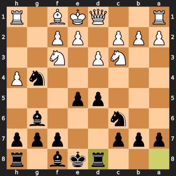


**10. Ng5** — White centralises the knight to g5, a good-looking square. The engine marginally preferred **h5** to keep chasing the g6 bishop, but **Ng5** is fine and keeps White decisively ahead.

### 10...Be7

Black plays **10...Be7**, attacking the knight on g5. The engine preferred **10...d4** — advancing the pawn to claim space and cramp White's pieces. **10...Be7** is reasonable — attack the knight, develop the bishop — but it's a slight inaccuracy. White remains around +4 ahead.

### 11. Nxd5

**11. Nxd5** — White grabs a pawn and threatens the bishop on e7. This is a decent move, winning more material. The engine preferred **11. e4** (around +4.00), slightly more efficient. But **11. Nxd5** keeps White firmly winning (+3.02). It's not the sharpest path, but with a massive material lead, you don't need to be. One small note: the white bishop on f1 is the most passive piece on the board at this point — getting that bishop into play would be a healthy long-term goal.

**11...Rxd5** — Black recaptures with the rook, forced and correct.

**12. e4** — White's best move: pushing the e-pawn attacks the rook on d5 and gains more space. The bishop on g6 now has only h5 as a safe retreat. Well played.

### 12...Rb5

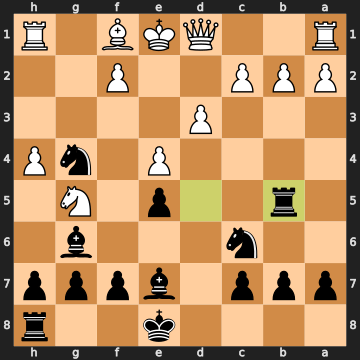


Black shuffles the rook to **12...Rb5**, getting off the attacked square. Reasonable, but the engine points out that **12...Nxf2** was a powerful try here — the knight on g4 could have hopped to f2, attacking both the queen on d1 and the rook on h1 simultaneously. That would have been a fork, winning material back. It wouldn't have fixed everything, but it would've made things messier. Black instead plays it safe, which keeps White comfortably ahead.

### 13. b3

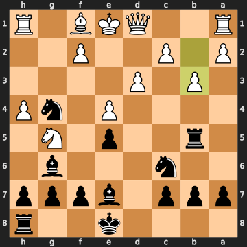


And here is the moment where the game completely flips — and it's a big one, redwood. White plays **13. b3**, apparently trying to defend the b2 pawn or prepare queenside activity. But the knight on g4 is just... sitting there. Doing whatever it wants. The correct move — and it's not even subtle — was **13. Qxg4**: simply take the knight! White's queen can just reach out and capture the knight on g4, and after **Rxb2**, White plays **h5**, keeps attacking, and remains up a huge amount of material. The engine says White would've been around +3.84 after **Qxg4**. Instead, **13. b3** does nothing about the knight, and the eval crashes to -4.96 — Black is now winning. A single move turned a won game into a lost one.

What happened here, psychologically? The likeliest explanation: White was focused on queenside pawn structure or defending the b2 pawn, and the knight on g4 — which had been hanging around harmlessly for several moves — just wasn't being perceived as an immediate threat. It's easy to develop a kind of "familiarity blindness" with a piece that's been on the board a while. **Qxg4** was the move. It was right there.

### 13...O-O

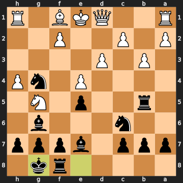


Now we get a curious moment in the other direction. Black castles — **13...O-O** — which is sensible for king safety, but the engine says **13...Bb4+** was a knockout blow here. After **13...Bb4+ 14. c3 Bxc3+ 15. Qd2 Bxd2+**, Black is winning pieces by check and demolishing what's left of White's position. By castling instead, Black lets White back off the ledge: the eval rebounds to +3.10 in White's favor. Two enormous blunders in consecutive moves — first White misses **Qxg4**, then Black misses **Bb4+**. The game is a seesaw.

### 14. c4

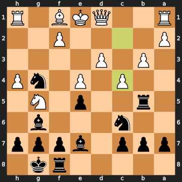


White plays **14. c4**, attacking the rook on b5. Again, though, **14. Qxg4** was still the right call — take the knight that's been hanging for four moves now! After **14. Qxg4 Rc5 15. Kd2**, White is back to a significant advantage. Instead, **14. c4** attacks the rook but still leaves the g4 knight alive, and the eval drops back to -4.03. White simply cannot keep ignoring that knight.

### 14...Bb4+

**14...Bb4+** — Black finally plays the check. This is the best move, and it's decisive: the bishop comes to b4 with check, forcing White's king to move. This is exactly the kind of aggressive resource that was available a move earlier too. White is in trouble.

### 15. Ke2

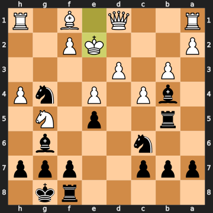


And this is where it ends. **15. Ke2** — White moves the king to e2. But look at what's on the board: Black has a knight on g4, a bishop on b4, and a rook on b5. The king has just walked onto e2. The engine says **15. Qd2** was the only move that didn't lose immediately — interposing the queen to block the bishop check and keeping the position alive, though still -4.29 for White. Instead, **15. Ke2** walks directly into checkmate in one.

### 15...Nd4#

**15...Nd4#** — checkmate. The knight on c6 hops to d4, and the white king on e2 has no escape. The bishop on b4 covers c3 and d2; the rook on b5 covers b2; the knight on d4 delivers check with no way out. A tidy finish.

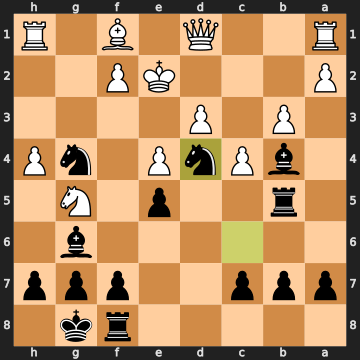


## Closing Reflection

So there you have it, redwood. A fifteen-move game with more twists than a country road.

Here's what the game actually tells us: you made some interesting choices (the **Bg5** and **g4** pushes had real ideas behind them), and when Black blundered the queen on move 8 by taking the g4 pawn, you found the right response immediately — **9. Bxd8** — and converted a winning advantage. The game was yours. The one lesson that screams out from this game is a simple one: **when an enemy piece is sitting undefended on your board, take it.** The knight on g4 sat there from move 8 all the way to the end of the game, and **Qxg4** was available and winning on moves 13 *and* 14 — two separate chances to just pick it up with the queen. That knight eventually participated in the mating attack.

The other thing worth taking away from the opening: the **Be3** on move 2 followed by **Nc3** on move 3 created a fork vulnerability that Black could have exploited twice with **...d4**. The fix was simple — **d4** yourself, pushing your own central pawn to take that square away. Early on, think about claiming central space before developing pieces to squares that can be attacked.

None of this is complicated stuff — it's just pattern recognition, and that comes with time and games. The structure's there; the instinct just needs a little more sharpening.
